# DNS实验报告 胡延伸 PB22050983
****

# nslookup

## 测试三个命令

首先得到MIT的官网：“ https://www.mit.edu.cn/ ”的 IP 地址。
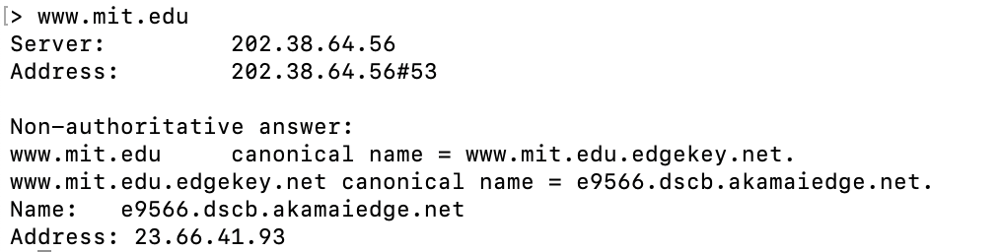{width=50%}

再获取发送 jmu.edu.cn 的 DNS 主机名：
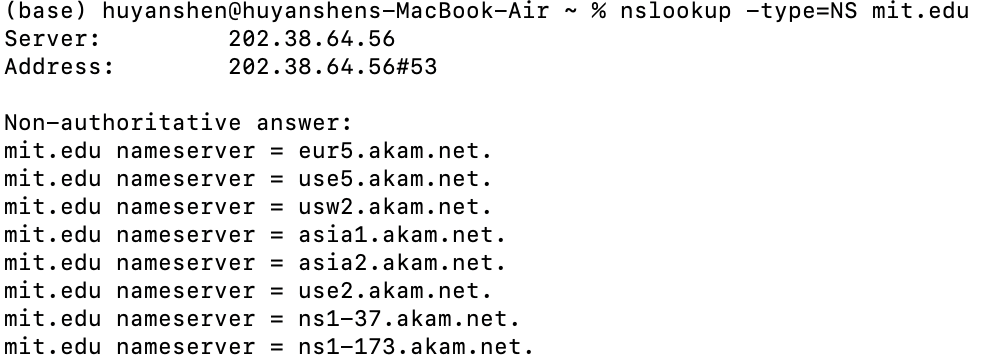{width=50%}

最后通过 DNS 服务器 bitsy.mit.edu 看看解析MIT官网:
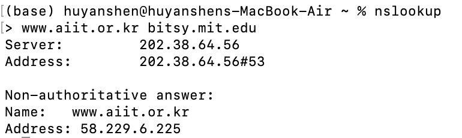{width=50%}

## 实验操作

1. Run nslookup to obtain the IP address of a Web server in Asia. What is the IP address of that server?
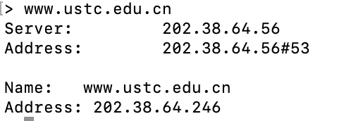{width=50%}
如上图，中国科学技术大学的IP地址为:202.38.64.246

2. Run nslookup to determine the authoritative DNS servers for a university in Europe.
剑桥大学 https://www.cam.ac.uk/
{width=50%}

3. Run nslookup so that one of the DNS servers obtained in Question 2 is queried for the mail servers for Yahoo! mail. What is its IP address?
雅虎邮箱的域名为 “mail.yahoo.com”，我选择服务器 “ns3.mythic-beasts.com” 来找。
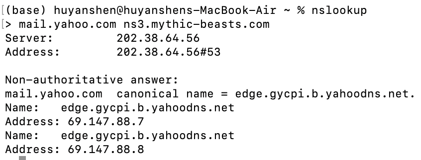{width=50%}
它的 IP 地址为: 69.147.88.6(或7)

# ipconfig(ifconfig)

## 基本使用

以下操作均在 MacOS14 中运行, 由于 MacOS 并不支持 ipconfig/ifconfig 的大部分命令，所以采用一些替代方法.

**列出主机的所有信息:**
`ifconfig`:
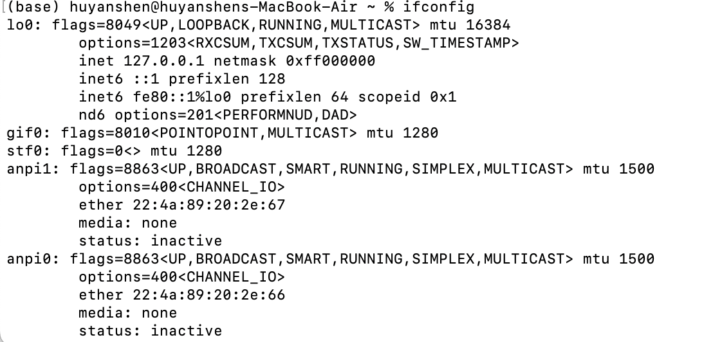{width=50%}

**使用 log show --info --predicate 'process == "mDNSResponder"' --last 1h查看过去 1h 的 DNS 缓存记录**
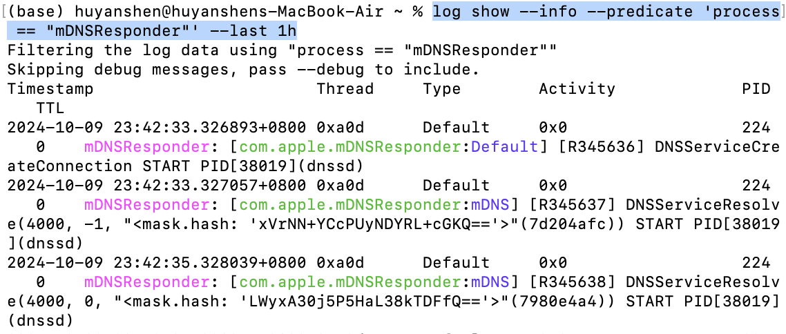{width=50%}

**清除缓存**
利用命令 `sudo killall -HUP mDNSResponder` 即可.

# Tracing DNS with Wireshark

- 首先利用 `sudo killall -HUP mDNSResponder` 清除 DNS 缓存.
- 清除浏览器缓存。
- 利用 `networksetup -getinfo Wi-Fi` 得到我的 IP 地址: 100.64.172.165
- 打开 Wireshark, 双击WiFi:en0,在顶部栏输入 filter 条件 ip.addr==100.64.172.165
- 使用浏览器访问网页： http://www.ietf.org
- 停止抓包。

## 问题解答

4. Locate the DNS query and response messages. Are then sent over UDP or TCP?
如图，用的是 UDP:
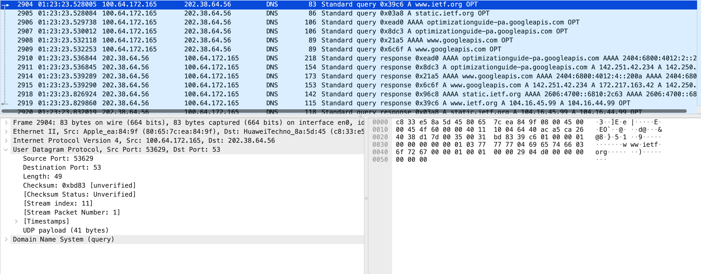{width=50%}
5. What is the destination port for the DNS query message? What is the source port of DNS response message?
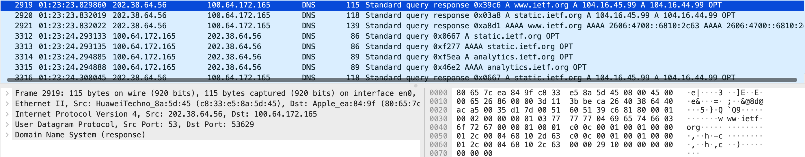{width=50%}
结合上图和上一题图，端口均为 53

6. To what IP address is the DNS query message sent? Use ipconfig to determine the IP address of your local DNS server. Are these two IP addresses the same? 
DNS 查询消息发送到:202.38.64.46,而本地DNS服务器为202.38.64.56,显然两者一样。

7. Examine the DNS query message. What “Type” of DNS query is it? Does the query message contain any “answers”?
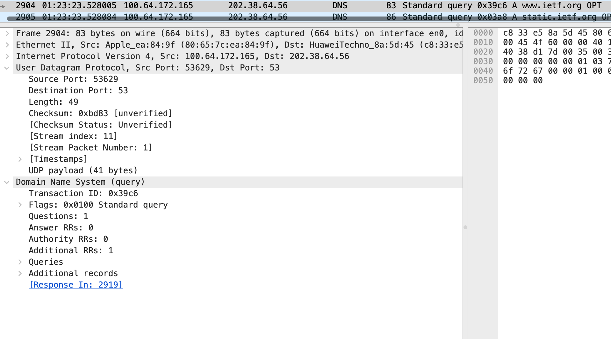{width=50%}
类型为A，没有任何 answers.
8. Examine the DNS response message. How many “answers” are provided? What do each of these answers contain?
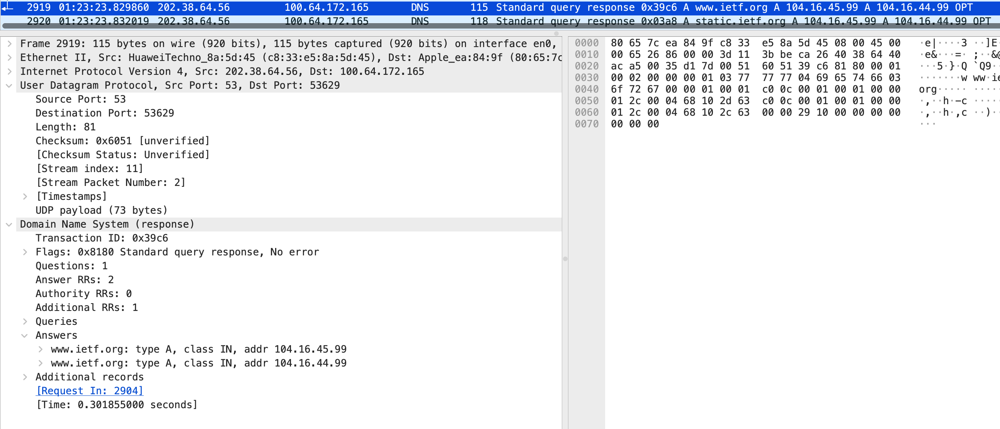{width=50%}
提供了 2 个 "answers"，是该域名的 2 个 IPV4 地址。
9. Consider the subsequent TCP SYN packet sent by your host. Does the destination IP address of the SYN packet correspond to any of the IP addresses provided in the DNS response message?
{width=50%}
如上图所示，是对应的
10. This web page contains images. Before retrieving each image, does your host issue new DNS queries?
没有，因为本机 DNS 已经被缓存了，不需要发起新的 DNS 查询。

# nslookup 的 DNS 查询①

## 实验步骤

启动数据包捕获，再使用nslookup查询 www.mit.edu，最后停止.

## 问题解答

11. What is the destination port for the DNS query message? What is the source port of DNS response message?
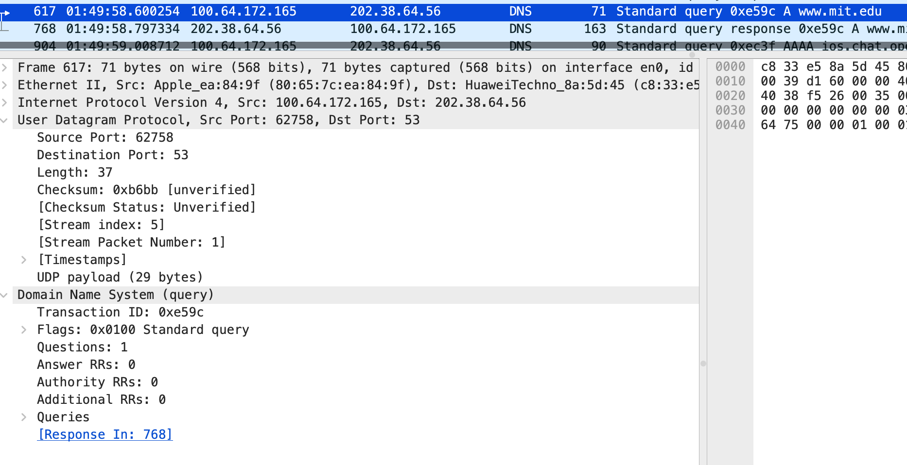{width=50%}
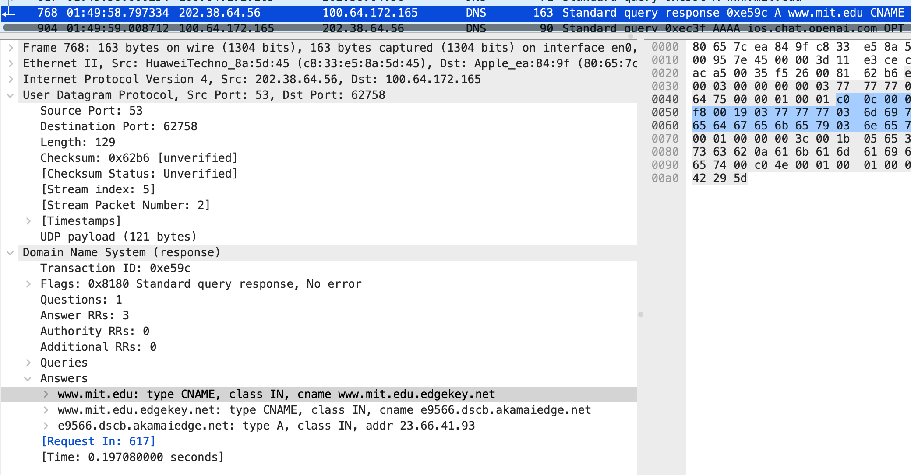{width=50%}
如上面两幅图，均为53
12. To what IP address is the DNS query message sent? Is this the IP address of your 
default local DNS server?
如上一题图，DNS 查询消息的目标 IP 地址是202.38.64.56，和我本地DNS服务器一致.
{width=50%}
13. Examine the DNS query message. What “Type” of DNS query is it? Does the query message contain any “answers”?
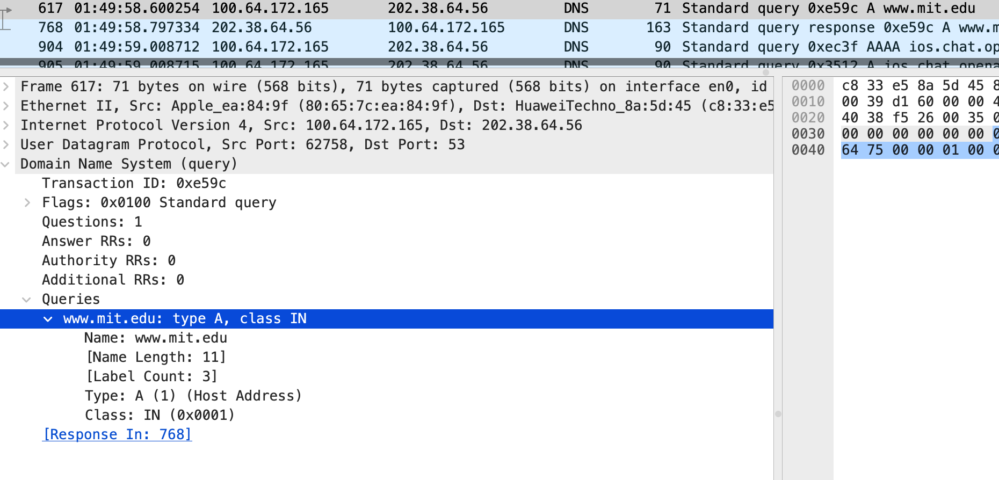{width=50%}
类型为A，表示查询 IP 地址，没有任何 "answers"。
14. Examine the DNS response message. How many “answers” are provided? What do each of these answers contain?
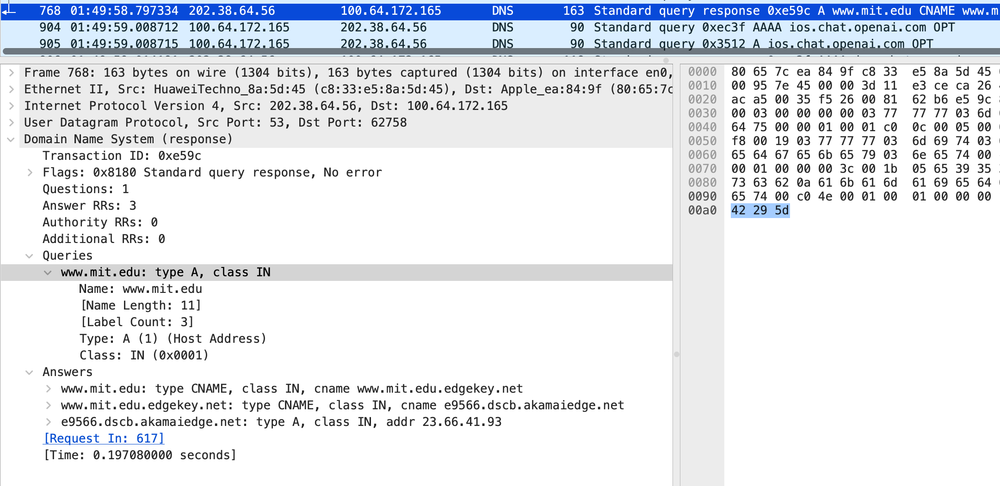{width=50%}
如上图，一共有 3 个answers, 分别包含正式名称 CNAME, 以及 IPV4 地址.
15. Provide a screenshot.
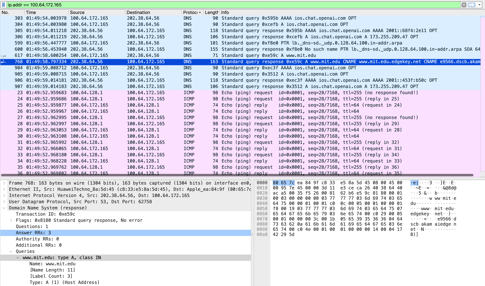{width=50%}

# nslookup 的 DNS 查询②

## 实验步骤

和上一步骤类似，只是把命令换成:
`nslookup -type=NS mit.edu`

16. To what IP address is the DNS query message sent? Is this the IP address of your default local DNS server?
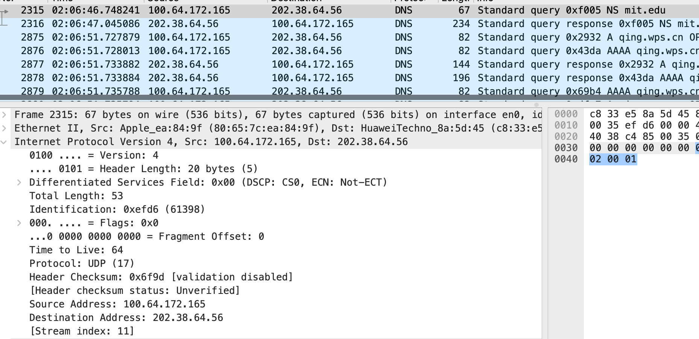{width=50%}
如上图，和上一实验一样地址为202.38.64.56，与我的本地DNS服务器地址一样。
17. Examine the DNS query message. What “Type” of DNS query is it? Does the query message contain any “answers”?
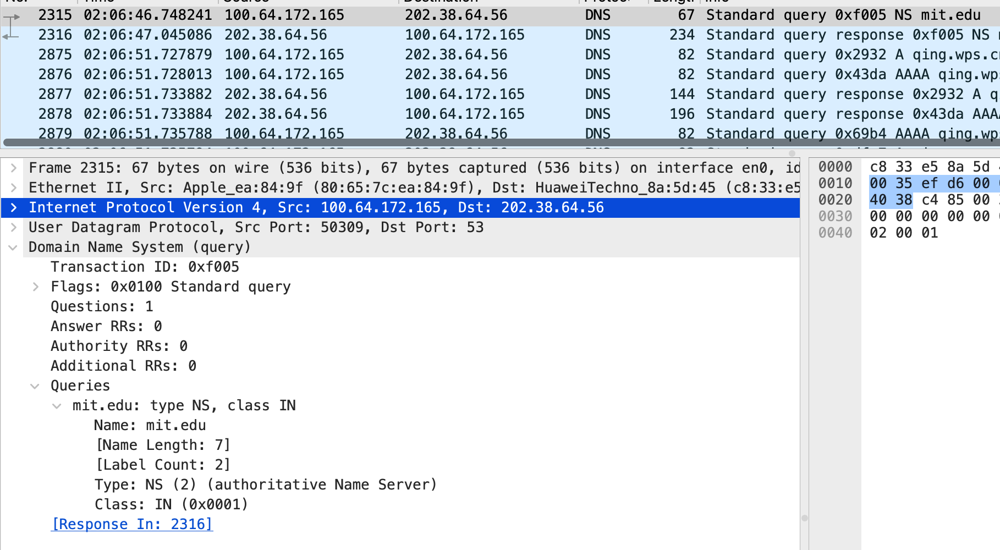{width=50%}
如上图，类型为 NS,表示查询权威 DNS 服务器，没有任何 "answers". 
18. Examine the DNS response message. What MIT nameservers does the response message provide? Does this response message also provide the IP addresses of the MIT namesers?
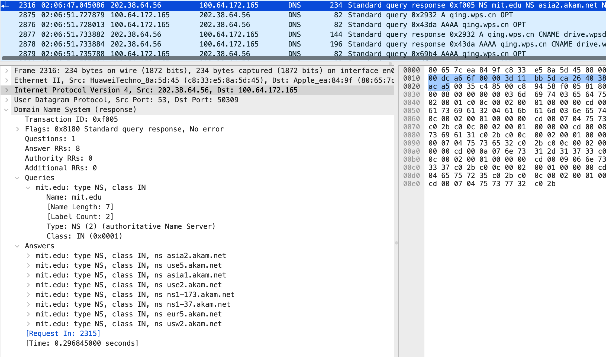{width=50%}
服务器如上图 Answers 中所示，响应消息没提供 MIT 的域名的 IP 地址。
19. Provide a screenshot。
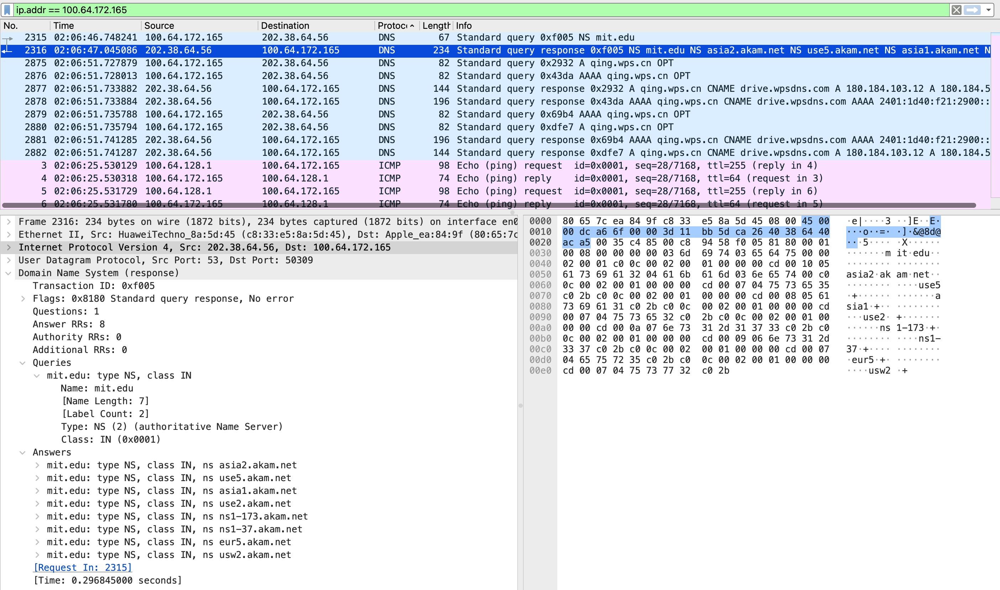{width=50%}

# nslookup 的 DNS 查询③

## 实验步骤

和前两个实验类似，只不过把命令替换成如下:

`nslookup www.aiit.or.kr bitsy.mit.edu`

得到 nslookup 结果为:
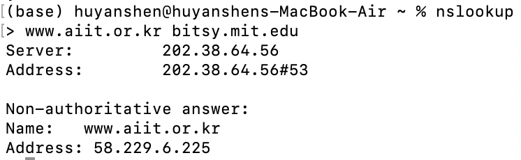{width=50%}

20. To what IP address is the DNS query message sent? Is this the IP address of your default local DNS server? If not, what does the IP address correspond to?
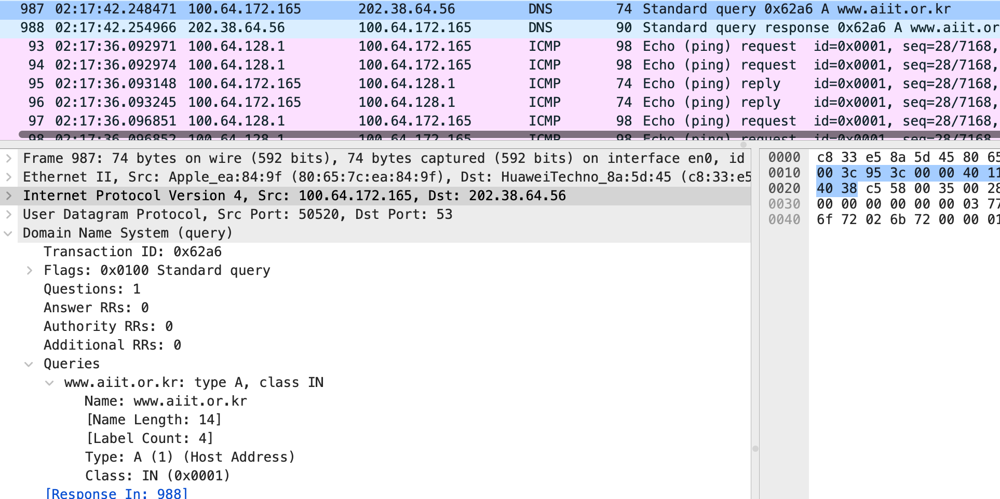{width=50%}
其地址为202.38.64.56，显然也和我的本地 DNS 地址一致.
21. Examine the DNS query message. What “Type” of DNS query is it? Does the query message contain any “answers”?
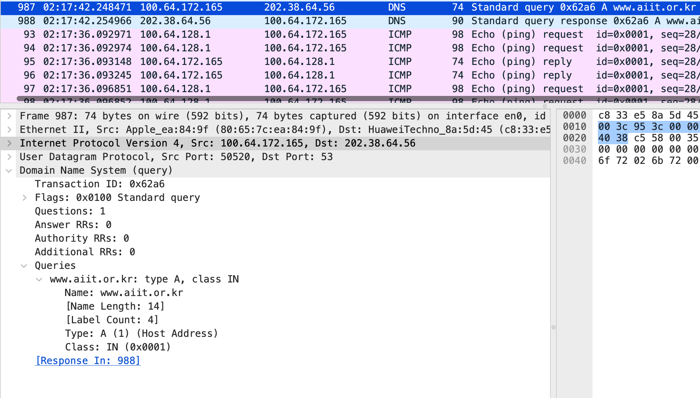{width=50%}
类型为 A，没有 Answers
22. Examine the DNS response message. How many “answers” are provided? What does each of these answers contain?
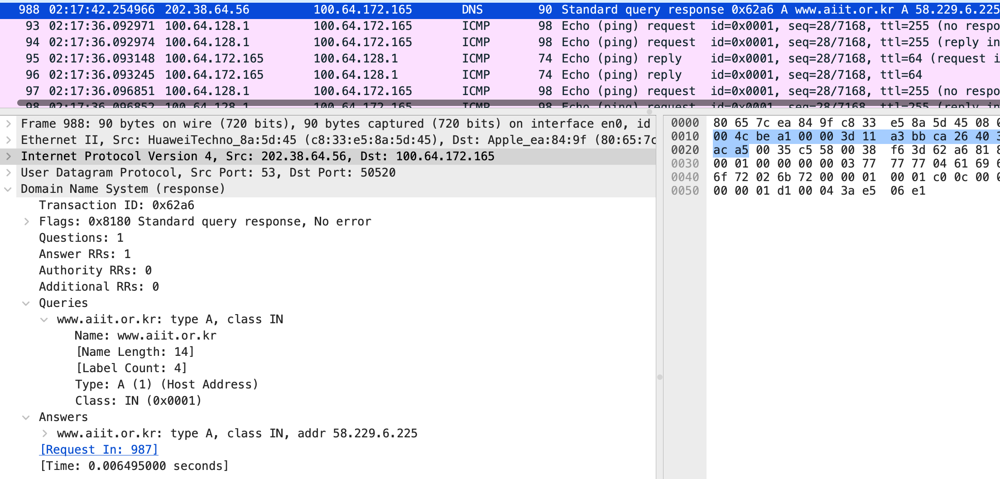{width=50%}
一共有 1 个 answer， 包含该域名的 IPV4 地址
23. Provide a screenshot.
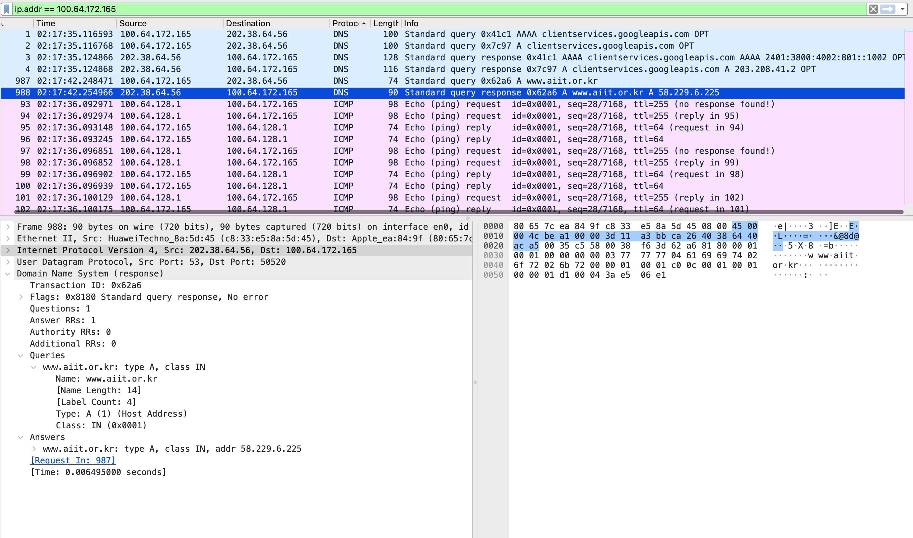{width=50%}
