# IP 实验报告

<big><b>胡延伸 PB22050983</b></big>

## traceroute

MacOS 上直接在终端输入 “traceroute + 长度” 即可发送特定长度的 UDP 数据报。

## 实验步骤

1. 打开 Wireshark 进行包捕捉

2. 利用 traceroute 依次发送 3 段不同长度（56， 2000， 3500）的数据报，如下图:

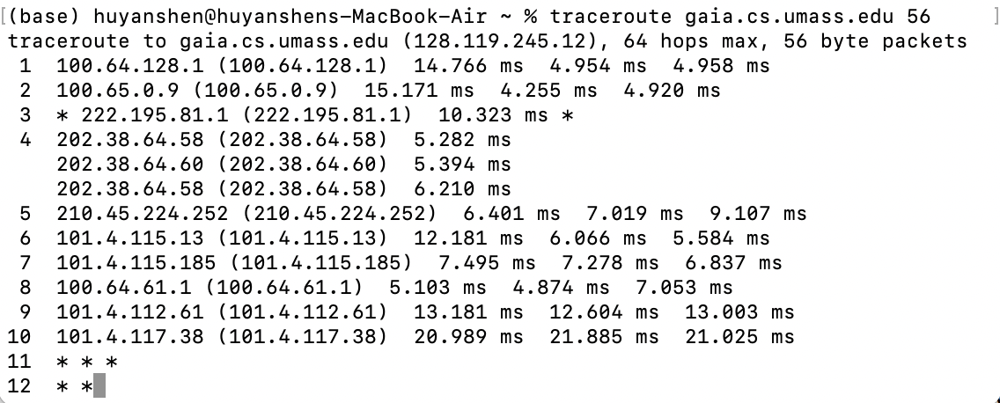

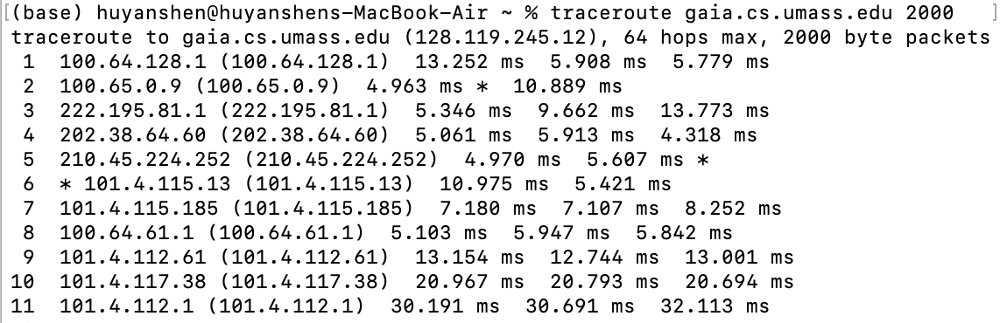

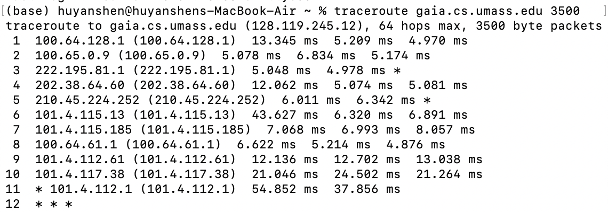

3. 停止 Wireshark 的包捕捉。由于本机网络捕获的包过于繁杂，所以采用官方提供的 trace 文件进行分析.

## A look at the captured trace

1. Select the first ICMP Echo Request message sent by your computer, and expand the Internet Protocol part of the packet in the packet details window. What is the IP address of your computer?

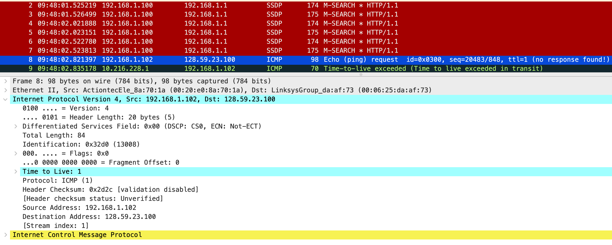

如上图，本地电脑的 IP 地址为: 192.168.1.102

2. Within the IP packet header, what is the value in the upper layer protocol field?

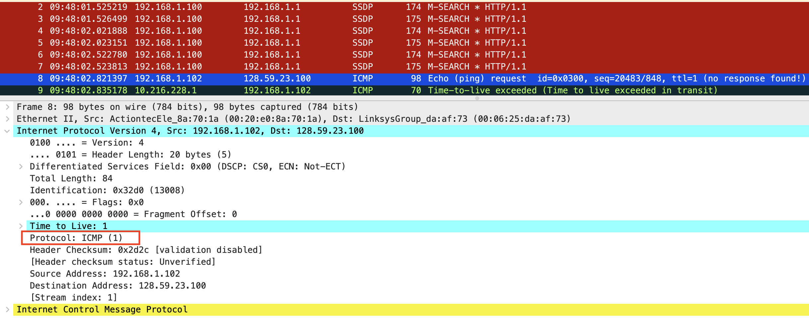

如上图，上层协议字段为1.

3. How many bytes are in the IP header? How many bytes are in the payload of the IP datagram? Explain how you determined the number of payload bytes.

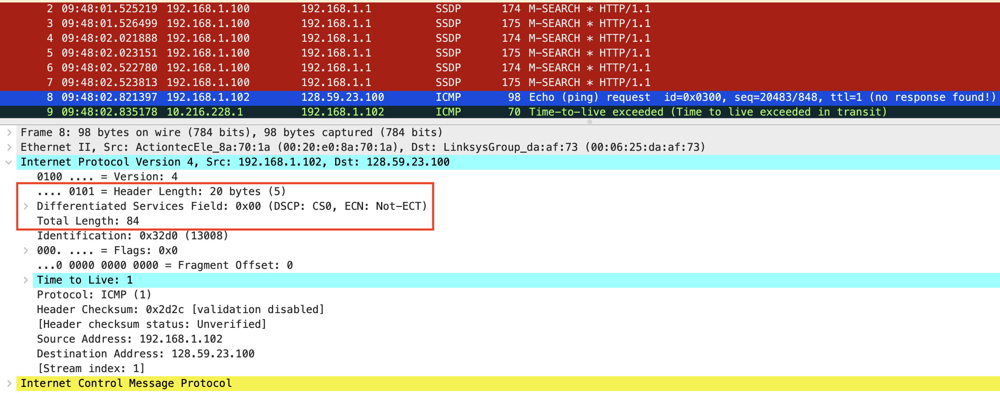

如上图，头部大小为 20 bytes; 总大小为 84 bytes, 故有效负载大小为 64 bytes.

4. Has this IP datagram been fragmented? Explain how you determined whether or not the datagram has been fragmented.

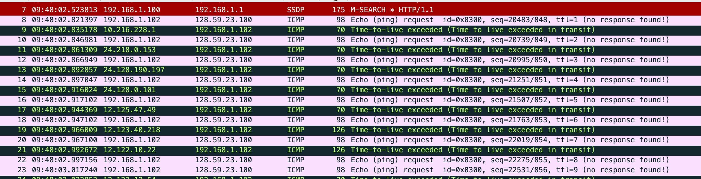

没有，因为如果数据报分段，应该会出现多个 TTL = 1 的包，但图中没有。

Sort the traced packets according to IP source address by clicking on the Sourcecolumn header; a small downward pointing arrow should appear next to the word Source. If the arrow points up, click on the Source column header again. 

如下图所示，按照 IP 地址降序排列的界面:

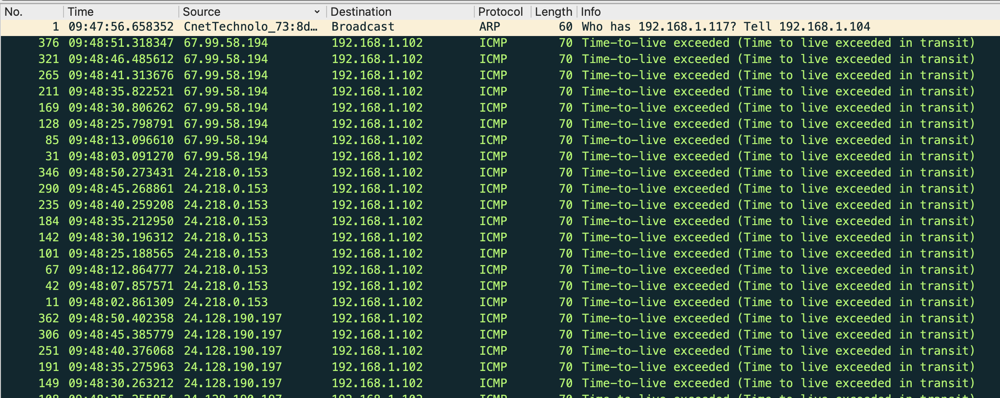

Select the first ICMP Echo Request message sent by your computer, and expand the Internet Protocol portion in the “details of selected packet header” window.

如下图:

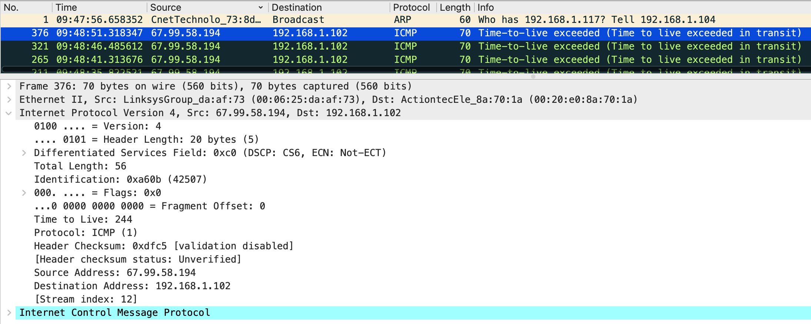

5. Which fields in the IP datagram always change from one datagram to the next within this series of ICMP messages sent by your computer?

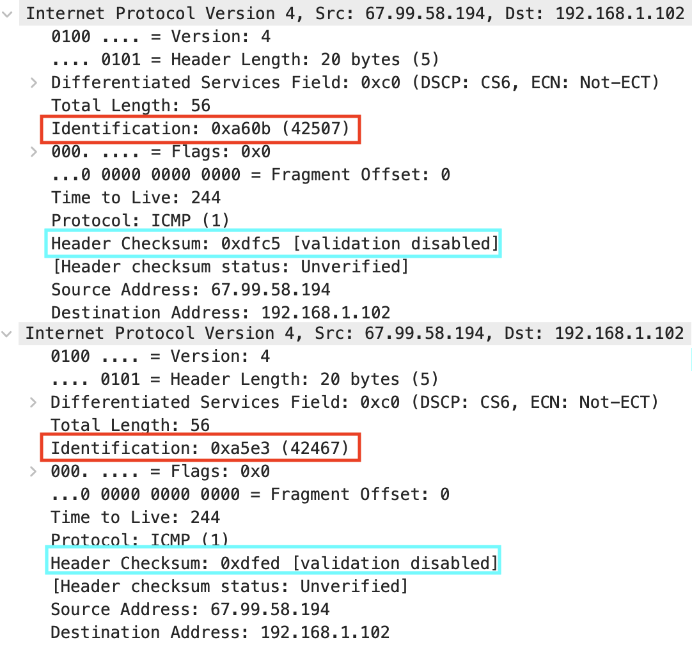

如上图，Identifaicaton, 和 Header Checksum 一直在改变。

6. Which fields stay constant? Which of the fields must stay constant? Which fields must change? Why?

保持不变：

    1. Explicit Congestion Notification，ECN：允许在不丢弃报文的同时通知对方网络拥塞的发生。
    2. Total Length：占 16 位字段，定义了报文总长，包含首部和数据，单位为字节。这个字段的最小值是 20（0 字节数据），最大值是65535。
    3. Fragment Offset：这个13位字段指明了每个分片相对于原始报文开头的偏移量，以8字节作单位。
    4. Source：报文的发送端；
    5. Destination：报文的接收端；
    6. Option：附加的首部字段可能跟在目的地址之后；

必须保持不变：

    1. 版本（Version）：占 4 bit，通信双方使用的版本必须一致，对于 IPv4 字段的值是4.
    2. 首部长度（Internet Header Length， IHL）：占 4 bit，首部长度说明首部有多少 32 位字（4字节）.
    3. 区分服务（Differentiated Services，DS）：占 6 bit，只有在使用区分服务时，这个字段才起作用，在一般的情况下都不使用这个字段.

必须改变:

    1. Identification：占 16 位，用来唯一地标识一个报文的所有分片；
    2. Time To Live，TTL：占 8 位，避免报文在互联网中永远存在。
    3. Header Checksum：占 16 位，检验和字段只对首部查错，在每一跳，路由器都要重新计算出的首部检验和并与此字段进行比对，如果不一致，此报文将会被丢弃；
    4. 数据

7. Describe the pattern you see in the values in the Identification field of the IP datagram

这用于唯一地标识一条报文的所有fragment，因此如果报文不同，则必须更改此值以便它能够唯一地标识报文。

8. What is the value in the Identification field and the TTL field?

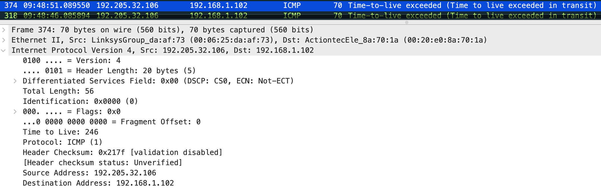

如上图, ID 为42507， TTL = 244

9. Do these values remain unchanged for all of the ICMP TTL-exceeded replies sent to your computer by the nearest (first hop) router? Why?

如下两张图：

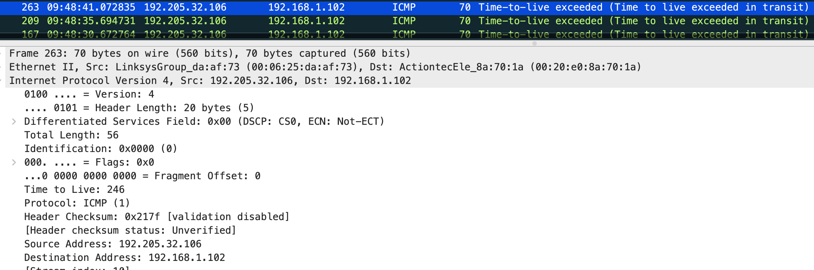

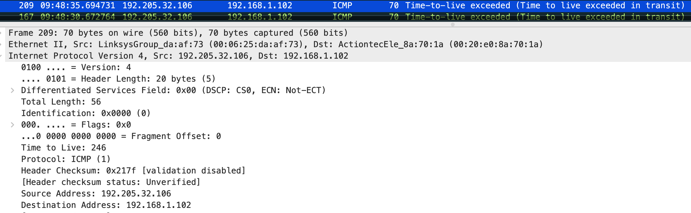

均保持不变；因为它们都是属于同一个报文的不同分片.

## Fragmentation

10. Find the first ICMP Echo Request message that was sent by your computer after you changed the Packet Size in pingplotter to be 2000. Has that message been fragmented across more than one IP datagram?

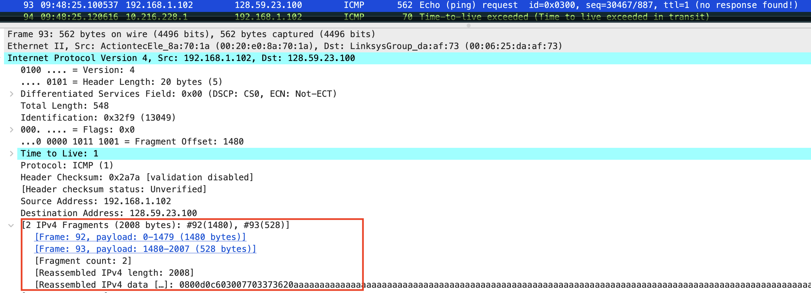

如上图，分成了两个分片。

11. Print out the first fragment of the fragmented IP datagram. What information in the IP header indicates that the datagram been fragmented? What information in the IP header indicates whether this is the first fragment versus a latter fragment? How long is this IP datagram?

打印的信息见附件.

如下图:

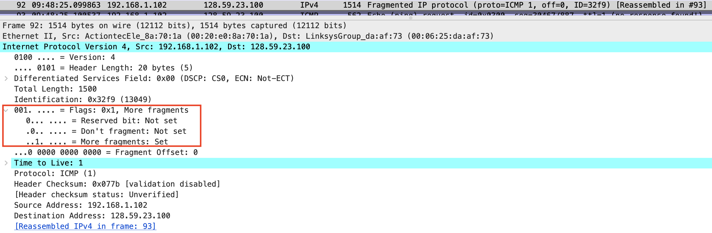

More fragments字段为 1 表示 Set，即该数据包被分片。通过fragment offset = 0判断这是第一个片段;分片长度为 1480 bytes。

12. Print out the second fragment of the fragmented IP datagram. What information in the IP header indicates that this is not the first datagram fragment? Are the more fragments? How can you tell?
打印信息见附件。
如下图:

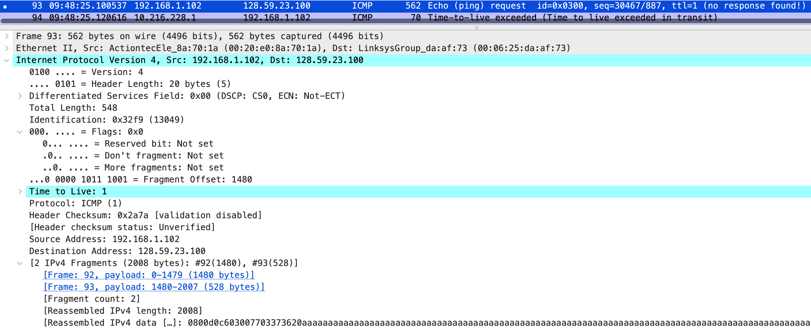

offset = 1480 表明这不是第一个分片；More fragments = Not set 表明没有更多的分片。

13. What fields change in the IP header between the first and second fragment?
全长（Total Length）、标志 （Flags）和分片偏移 （Fragment Offset）

Now find the first ICMP Echo Request message that was sent by your computer after you 
changed the Packet Size in pingplotter to be 3500.

14. How many fragments were created from the original datagram?
如下图:
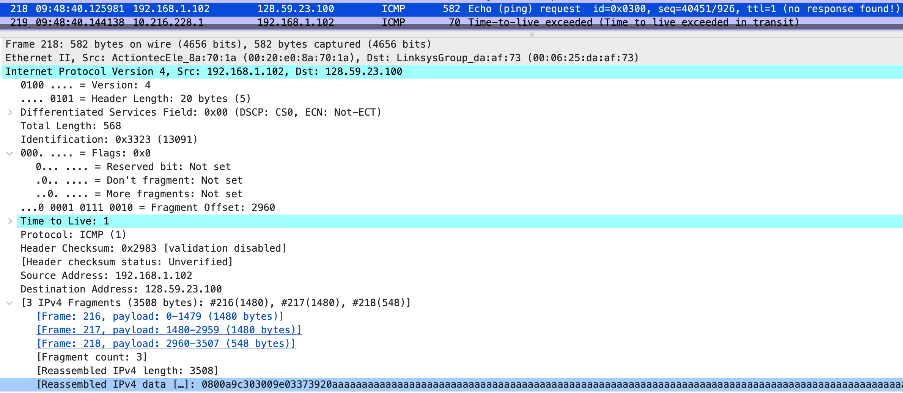

一共分成了 3 个分片

15. What fields change in the IP header among the fragments?
和数据报大小为2000情况类似，全长（Total Length）、标志 （Flags）和分片偏移 （Fragment Offset）会改变。