# TCP 实验报告

<big><b>胡延伸 PB22050983</b></big>

---

## Capturing a bulk TCP transfer from your computer to a remote server

由于本地网络抓取 packets 时干扰过大，因此读取官方提供的 Trace 文件.

打开后如下图:

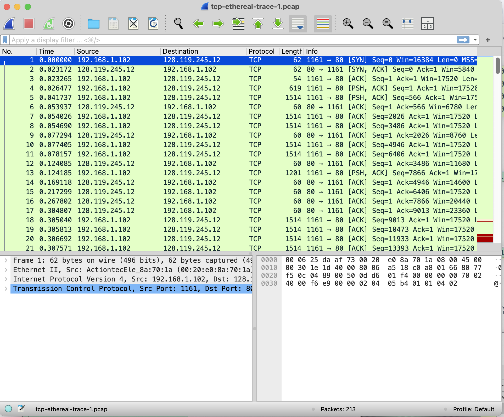{width=60%}

## A first look at the captured trace

### 问题

1. What is the IP address and TCP port number used by the client computer (source) that is transferring the file to gaia.cs.umass.edu?

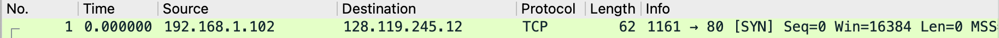{width=60%}

如上图, 本地电脑IP:192.168.1.102; TCP 端口为:1161

1. What is the IP address of gaia.cs.umass.edu? On what port number is it sending and receiving TCP segments for this connection?

同理，如题 1 图: gaia.cs.umass.edu IP 为: 128.119.245.12; TCP 端口为:80

## TCP Basics

### 问题

3. What is the sequence number of the TCP SYN segment that is used to initiate the TCP connection between the client computer and gaia.cs.umass.edu? What is it in the segment that identifies the segment as a SYN segment?

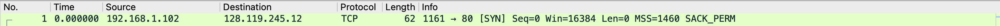{width=60%}

如上图，SYN序列号为0; 

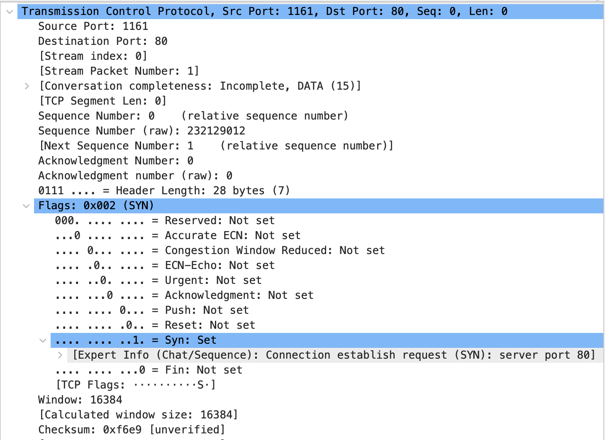{width=60%}

如上图, segment 中 Flags 显示:0x002(SYN),表示这个 segment 为 SYN.

4. What is the sequence number of the SYNACK segment sent by gaia.cs.umass.edu to the client computer in reply to the SYN? What is the value of the Acknowledgement field in the SYNACK segment? How did gaia.cs.umass.edu determine that value? What is it in the segment that identifies the segment as a SYNACK segment?

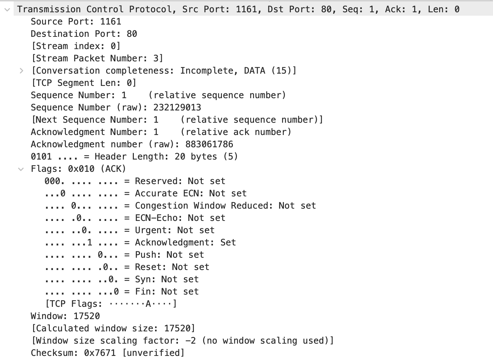{width=60%}

Sequence number: 1;
Acknowledgement field: 1;
Acknowlegment:set表明 ACK字段有效，则观察 Acknowledgement 那一栏即可获取该值；   
Flags field:0x010(ACK)，且下面Acknowlegment:set 表明这就是一个 SYNACK segment

5. What is the sequence number of the TCP segment containing the HTTP POST command? Note that in order to find the POST command, you’ll need to dig into the packet content field at the bottom of the Wireshark window, looking for a segment with a “POST” within its DATA field.

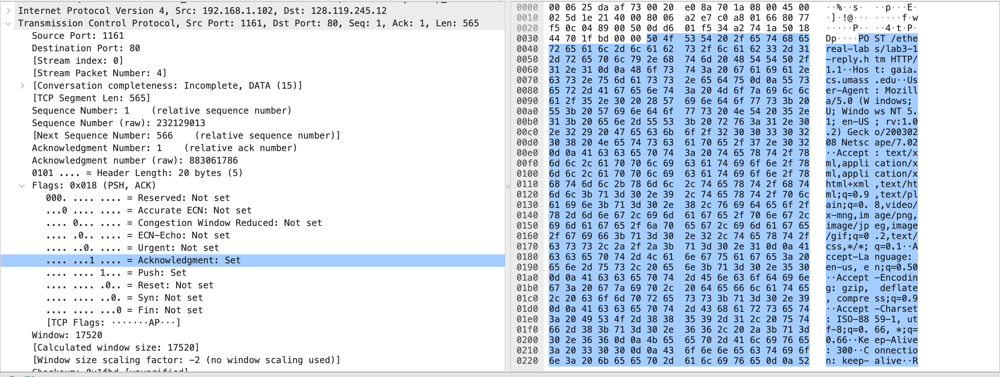{width=60%}

如上图，sequence number 为 1.

6. Consider the TCP segment containing the HTTP POST as the first segment in the TCP connection. What are the sequence numbers of the first six segments in the TCP connection (including the segment containing the HTTP POST)? At what time was each segment sent? When was the ACK for each segment received? Given the difference between when each TCP segment was sent, and when its acknowledgement was received, what is the RTT value for each of the six segments? What is the EstimatedRTT value (see Section 3.5.3, page 242 in text) after the receipt of each ACK? Assume that the value of the EstimatedRTT is equal to the measured RTT for the first segment, and then is computed using the EstimatedRTT equation on page 242 for all subsequent segments
   1. segment 1
    
    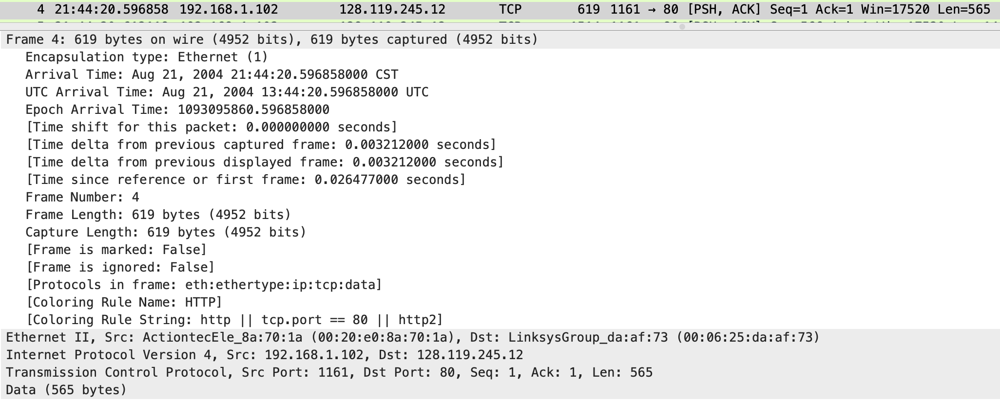{width=60%}

    sequence number: 1
    到达时间：Aug 21, 2004 21:44:20.596858000 CST

    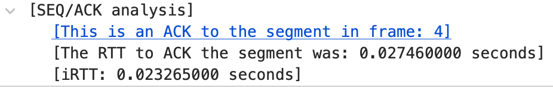{width=60%}

    ACK 到达时间:Aug 21, 2004 21:44:20.624318000 CST
    RTT: 0.027460000
    EstimatedRTT = (1 - a) × EstimatedRTT + a × SampleRTT, a 取0.125，初始值取第一次采样的RTT，则 EstimatedRTT = RTT = 0.027460000s

   2. segment 2

    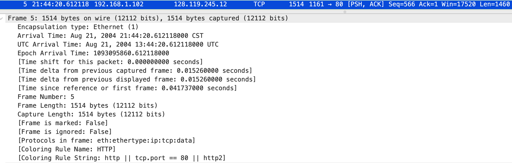{width=60%}

    sequence number: 566
    到达时间:Aug 21, 2004 21:44:20.612118000 CST

    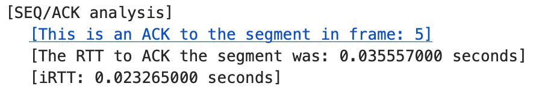{width=60%}

    ACK 到达时间:Aug 21, 2004 21:44:20.647675000 CST
    RTT: 0.035557000
    EstimatedRTT = (1 - a) × EstimatedRTT + a × SampleRTT = 0.875 × 0.027460000 + 0.125 × 0.035557000 = 0.028472125s

   3. segment 3

    {width=60%}

    sequence number: 2026
    到达时间:Aug 21, 2004 21:44:20.624407000 CST

    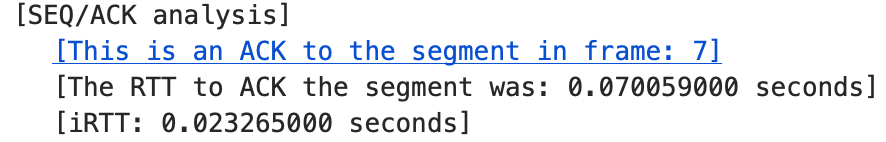{width=60%}

    ACK 到达时间:Aug 21, 2004 21:44:20.694466000 CST
    RTT:0.070059000 seconds
    EstimatedRTT = 0.875 × 0.028472125 + 0.125 × 0.070059000 = 0.033670484 seconds

   4. segment 4

    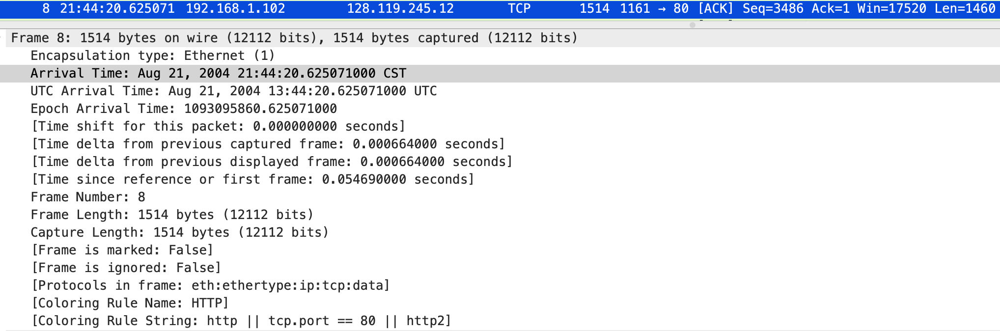{width=60%}

    sequence number: 3486
    到达时间:Aug 21, 2004 21:44:20.625071000 CST

    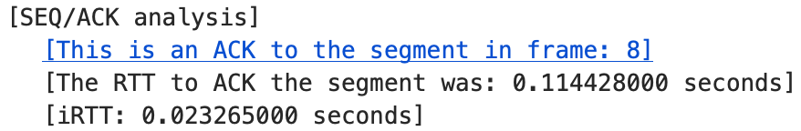{width=60%}

    ACK 到达时间:Aug 21, 2004 21:44:20.739499000 CST
    RTT:0.114428000 seconds
    EstimatedRTT = 0.875 × 0.033670484 + 0.125 × 0.114428000 = 0.043765173 seconds

   5. segment 5

    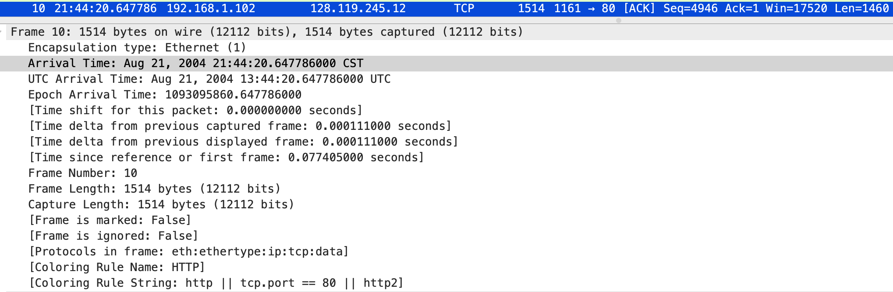{width=60%}

    sequence number: 4946
    到达时间: Aug 21, 2004 21:44:20.647786000 CST

    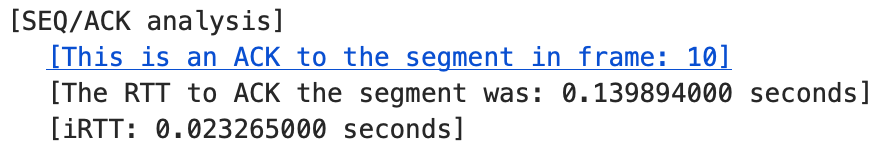{width=60%}

    ACK 到达时间:Aug 21, 2004 21:44:20.787680000 CST
    RTT:0.139894000 seconds
    EstimatedRTT = 0.875 × 0.043765173 + 0.125 × 0.139894000 = 0.055781277 seconds

   6. segment 6

   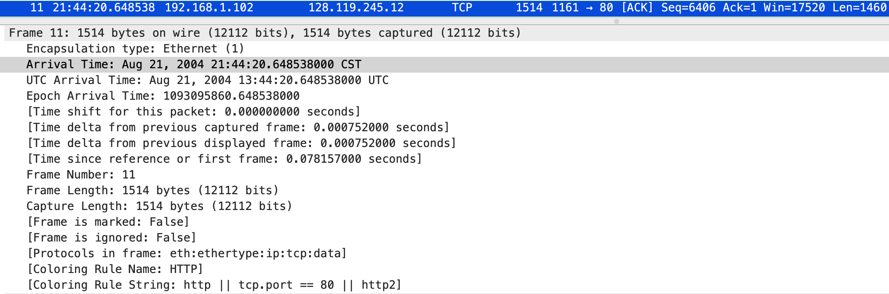{width=60%}

   sequence number: 6406
   到达时间: Aug 21, 2004 21:44:20.648538000 CST

   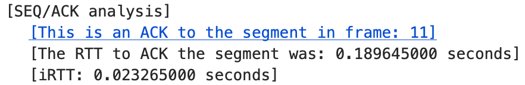{width=60%}

   ACK 到达时间: Aug 21, 2004 21:44:20.838183000 CST
    RTT:0.189645000 seconds
    EstimatedRTT = 0.875 × 0.055781277 + 0.125 × 0.189645000 = 0.072514242 seconds

7. What is the length of each of the first six TCP segments?
如上面图片所示，前 6 个 segments 的长度依次为: 565, 1460, 1460, 1460, 1460, 1460

8. What is the minimum amount of available buffer space advertised at the received for the entire trace? Does the lack of receiver buffer space ever throttle the sender?

{width=60%}

最小缓冲区大小如上图为5840；由于 TCP 的流量控制服务，缺少接收器缓冲区空间会限制发送方传送 TCP 区段，能够消除发送方使接收方缓存溢出的可能性，使得发送方的发送速率与接收方应用程序的读取速率相匹配。

9. Are there any retransmitted segments in the trace file? What did you check for (in the trace) in order to answer this question?

    检查数据包的时间序列如下图:

    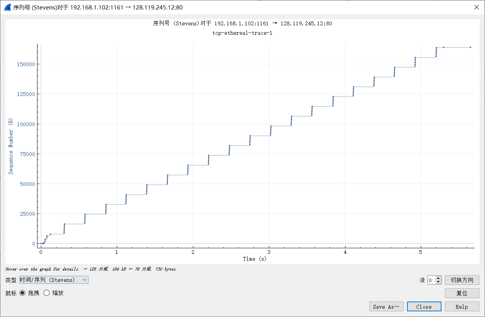{width=60%}

    如上图，segments 的序列呈递增的趋势，因此不存在重传的情况。

10. How much data does the receiver typically acknowledge in an ACK? Can you identify cases where the receiver is ACKing every other received segment (see Table 3.2 on page 250 in the text).

ACK 中的数据量取决于窗口大小 cwnd，接收方会从 ACK 中识别确认号。

通过查看连续的 ACK segment 的 traces，可以检查出其确认的 segment 是否是连续的或是每隔一个 segment 再确认的.

11. What is the throughput (bytes transferred per unit time) for the TCP connection?

查看 POST 请求中运输的数据量:

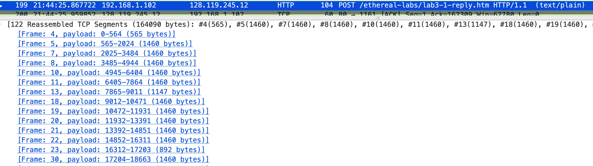{width=60%}

如上图为 164090 bytes.

在查看接收方的接收时间:

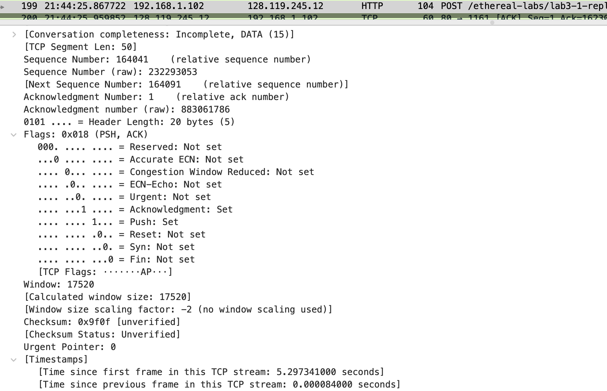{width=60%}

如上图为 5.297341000 seconds

则平均吞吐量为: 吞吐量 = 164090 ÷ 5.297341000 = 30975.9179181 bytes/s

## TCP congestion control in action

打开 Wireshark 的时序分析, 如下图:

{width=60%}

### 问题

12. Use the Time-Sequence-Graph(Stevens) plotting tool to view the sequence number versus time plot of segments being sent from the client to the gaia.cs.umass.edu server. Can you identify where TCP’s slowstart phase begins and ends, and where congestion avoidance takes over? Comment on ways in which the measured data differs from the idealized behavior of TCP that we’ve studied in the text.
慢启动阶段开始时，TCP发送速率较慢，但呈指数型增长，如下图，当第一个 TCP 区段刚刚发送出去时，此时即为慢启动刚开始时:

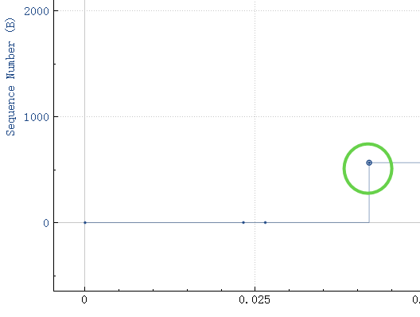{width=60%}

在分组 23 处, 这样的指数型增长的速率突然停滞，并且这个分组之后，TCP发送速率增长呈线性性（即每一个区段发送后增长量相同）说明这个时候发生了拥塞，进入拥塞避免阶段。

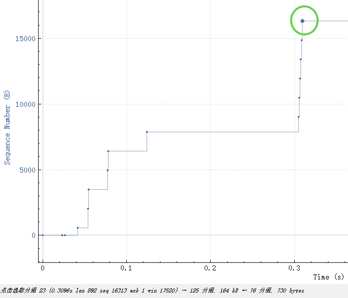{width=60%}

如下图，随之而来的区段即为 congestion-avoidance 开始阶段:

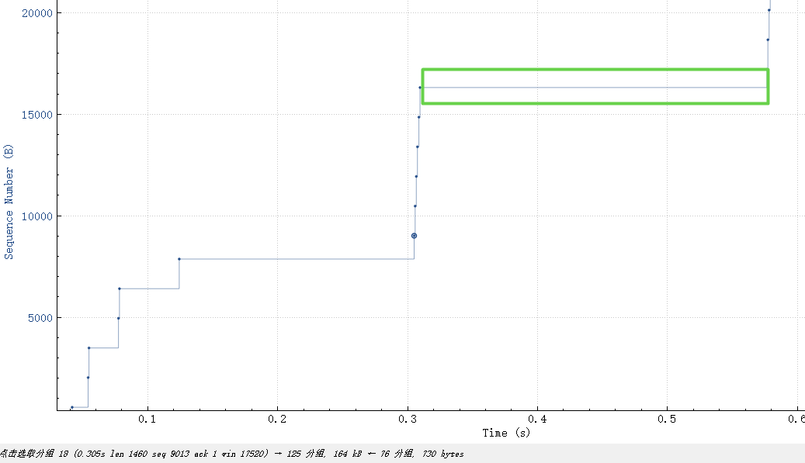{width=60%}

13. Comment on ways in which the measured data differs from the idealized behavior of TCP that we’ve studied in the text.
慢启动并非永远是最高效的。在本例中，刚开始发送的文件大小非常小，由于慢启动阶段开始时发送速率很小，故发送这个文件需要较长时间，而如果不采用慢启动，将一开始的窗口大小设置的很大，则只需要很段时间即可发送完，并且不会引起拥塞
