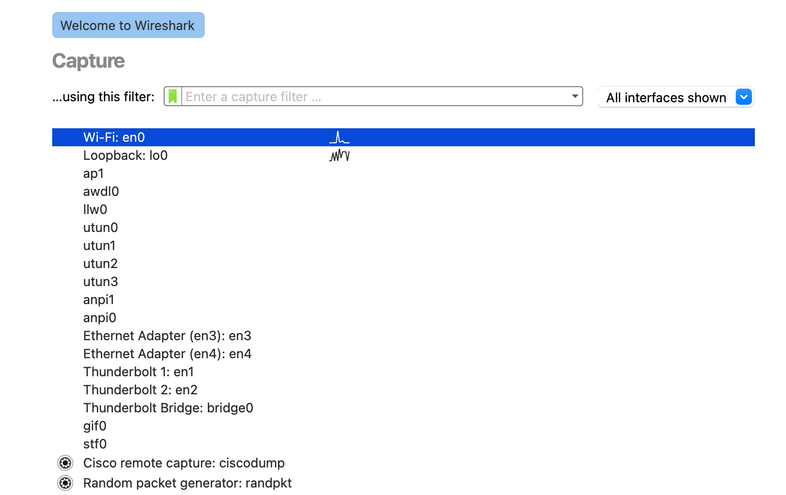
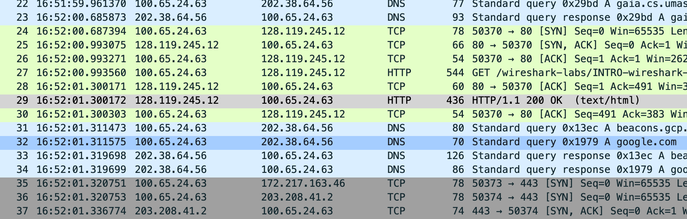
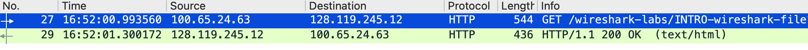

# 第一次实验
打开 Wireshark 后，在 MacOS 操作系统下，会直接显示 Interfaces 面板，双击 Wi-Fi:en0 选项，开启抓包页面。

用浏览器访问实验文档中给的示例网址 http://gaia.cs.umass.edu/wireshark-labs/INTRO-wireshark-file1.html 后，停止抓包。在 filter 搜索框中输入 http 得到包含对该网址的 GET 请求 及 OK 响应。找到后点击进入观察 packet list.

## 问题

1. List 3 different protocols that appear in the protocol column in the unfiltered packet-listing window in step 7 above.

    如下图: TCP, HTTP, DNS

    

2. How long did it take from when the HTTP GET message was sent until the HTTP OK reply was received? (By default, the value of the Time column in the packet-listing window is the amount of time, in seconds, since Wireshark tracing began. To display the Time field in time-of-day format, select the Wireshark View pull down menu, then select Time Display Format, then select Time-of-day.)

    找到 HTTP Get 和 HTTP OK 两行，选择 Time Display Format 为 Time-of-day, 比较这两行的time 的值，相减得: 1.300172 - 0.993560 = 0.306612(s) 

    

3. What is the Internet address of the gaia.cs.umass.edu (also known as www-net.cs.umass.edu)? What is the Internet address of your computer?

    

    Internet address of gaia.cs.umass.edu: 128.119.245.12
    我的 IP: 100.65.24.63

4. Print the two HTTP messages (GET and OK) referred to in question 2 above. To do so, select Print from the Wireshark File command menu, and select the “Selected Packet Only” and “Print as displayed” radial buttons, and then click OK.

    见打印结果 PDF 文件: wireshark_HTTP_GET.pdf 和 wireshark_HTTP_OK.pdf。