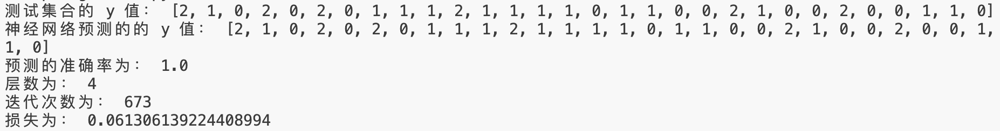
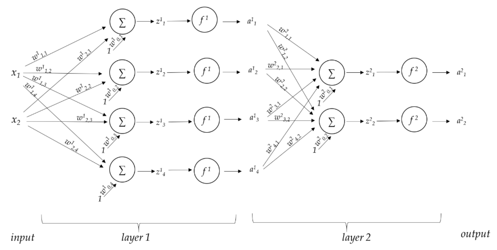
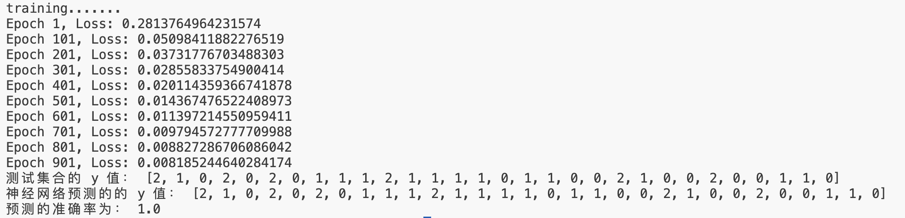
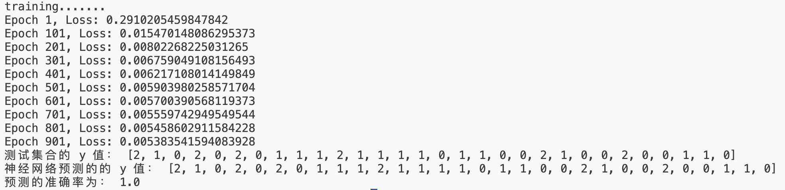

# LAB 2 实验报告

<center><big><b>胡延伸 PB22050983</b></big></center>

## 数据集的划分

利用 `train_test_split` 函数将 iris 数据集划分为 8:2 的两部分，分别为训练集和测试集

## 调用现有库

`scikit-learn` 包中封装了 `MLPClassifier`, 直接调用库函数完成模型的构建、训练及预测。代码如下:

```Python
mlp = MLPClassifier(hidden_layer_sizes=(10, 10), max_iter=1000)

# 拟合数据
mlp.fit(standard_train, Y_train)

# 得到预测结果
result = mlp.predict(standard_test)
```

### 现有库运行结果

测试结果如下：



## 手动实现神经网络

### 网络结构

神经网络分为输入层、全连接层、激活层、全连接层、激活层、输出层，网络结构简图如下:



其中，$f^1$ 和 $f^2$ 均为 `Sigmoid` 函数

### Sigmoid 函数

激活函数 `Sigmoid` 函数如下：

\[Sigmoid(x) = \frac{1}{1+e^{-x}}\]

其导数为：

\[Sigmoid(x)(1- Sigmoid(x))\]

### 前向传播

将输入 `X` 依次通过两遍全连接层、激活层即可。

### 反向传播

根据链式法则，依次计算每层的梯度:

1. **输出层**

- 损失 $L$ 对 $output$ 的导数:\[\delta_{output} = \frac{\partial L}{\partial output} = -(y - output)\]
- $L$ 对 $z_2$ 的导数:\[\delta_{z_2} = \delta_{output}\cdot\sigma'(z_2)\]
- $L$ 对第二层隐藏层权重和偏置的梯度:\[\frac{\partial L}{\partial W_2} = a_1^T \cdot \delta_{z_2}\]\[\frac{\partial L}{\partial b_2} = \sum \delta_{z_2}\]

2. **隐藏层**

- $L$ 对 $a_1$ 的梯度:\[ \delta_{a_1} = \delta_{z_2} \cdot W_2^T\]
- $L$ 对 $z_1$ 的梯度：\[\delta_{z_1} = \delta_{a_1} \cdot \sigma'(z_1)\]
- $L$ 对第一层权重和偏置的梯度:\[\frac{\partial L}{\partial W_1} = X^T \cdot \delta_{z_1}\]\[ \frac{\partial L}{\partial b_1} = \sum \delta_{z_1}\]

### 修改模型超参数进行对比

模型超参数有 `hidden_size` ，`learning_rate` 和 `epoch`:

1. `hidden_size` = 10, `learning_rate` = 0.01, `epoch` = 1000:



2. `hidden_size` = 15, `learning_rate` = 0.05, `epoch` = 1000:



3. `hidden_size` = 5, `learning_rate` = 0.05, `epoch` = 1000:


## 反馈

1. **花费的时间**: 实验 2 小时；作业： 3 小时。
2. **体验**：这次实验偏容易，作业适中。作业能够一直保持这种难度最好不过，证明题题干脉络清晰，计算题数据合理。

