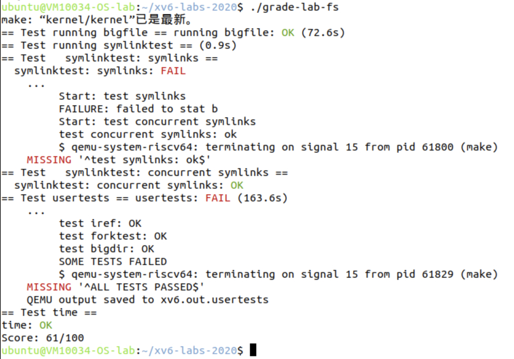

# Lab6 File system

- Name: 胡延伸
- Student ID: PB22050983
- Virtual Machine Username: PB22050983


## Large files

### Experimental analysis

The purpose of this experiment is to increase the maximum file size that xv6 can support. By default, xv6's file size is limited by its direct and single indirect block addressing scheme. The goal is to implement double indirect blocks to allow for larger file sizes.

Original xv6 file size limitation:
- NDIRECT (12) direct blocks
- NINDIRECT (128) indirect blocks
- Total size = (12 + 128) * BSIZE = 140 * 1024 bytes

After adding double indirect blocks:
- NDIRECT (11) direct blocks (reduced by 1 to add double indirect)
- NINDIRECT (128) indirect blocks
- Double indirect blocks (128 * 128)
- New total size = (11 + 128 + 128*128) * BSIZE = 16,523 * 1024 bytes

### Experimental process

1. Modified `fs.h` to add double indirect block support:
```c
#define NDIRECT 11
#define NINDIRECT (BSIZE / sizeof(uint))
#define NDINDIRECT (NINDIRECT * NINDIRECT)
#define MAXFILE (NDIRECT + NINDIRECT + NDINDIRECT)

// On-disk inode structure
struct dinode {
  // ... existing fields ...
  uint addrs[NDIRECT+2];   // Data block addresses (12 -> 13)
};
```

2. Modified `fs.c` to implement double indirect block support in `bmap`:
```c
static uint
bmap(struct inode *ip, uint bn)
{
  uint addr, *a;
  struct buf *bp;

  if(bn < NDIRECT){
    if((addr = ip->addrs[bn]) == 0)
      ip->addrs[bn] = addr = balloc(ip->dev);
    return addr;
  }
  bn -= NDIRECT;

  if(bn < NINDIRECT){
    // Load indirect block
    if((addr = ip->addrs[NDIRECT]) == 0)
      ip->addrs[NDIRECT] = addr = balloc(ip->dev);
    bp = bread(ip->dev, addr);
    a = (uint*)bp->data;
    if((addr = a[bn]) == 0){
      a[bn] = addr = balloc(ip->dev);
      log_write(bp);
    }
    brelse(bp);
    return addr;
  }
  bn -= NINDIRECT;

  // Double indirect block
  if(bn < NDINDIRECT){
    // Load double indirect block
    if((addr = ip->addrs[NDIRECT + 1]) == 0)
      ip->addrs[NDIRECT + 1] = addr = balloc(ip->dev);
    bp = bread(ip->dev, addr);
    a = (uint*)bp->data;
    uint index1 = bn / NINDIRECT;
    uint index2 = bn % NINDIRECT;
    
    if((addr = a[index1]) == 0){
      a[index1] = addr = balloc(ip->dev);
      log_write(bp);
    }
    brelse(bp);
    
    // Load indirect block
    bp = bread(ip->dev, addr);
    a = (uint*)bp->data;
    if((addr = a[index2]) == 0){
      a[index2] = addr = balloc(ip->dev);
      log_write(bp);
    }
    brelse(bp);
    return addr;
  }

  panic("bmap: out of range");
}
```

3. Modified `itrunc` in `fs.c` to handle double indirect block deallocation:
```c
void
itrunc(struct inode *ip)
{
  int i, j;
  struct buf *bp, *bp2;
  uint *a, *a2;

  // Free direct blocks
  for(i = 0; i < NDIRECT; i++){
    if(ip->addrs[i]){
      bfree(ip->dev, ip->addrs[i]);
      ip->addrs[i] = 0;
    }
  }

  // Free indirect blocks
  if(ip->addrs[NDIRECT]){
    bp = bread(ip->dev, ip->addrs[NDIRECT]);
    a = (uint*)bp->data;
    for(i = 0; i < NINDIRECT; i++){
      if(a[i])
        bfree(ip->dev, a[i]);
    }
    brelse(bp);
    bfree(ip->dev, ip->addrs[NDIRECT]);
    ip->addrs[NDIRECT] = 0;
  }

  // Free double indirect blocks
  if(ip->addrs[NDIRECT+1]){
    bp = bread(ip->dev, ip->addrs[NDIRECT+1]);
    a = (uint*)bp->data;
    for(i = 0; i < NINDIRECT; i++){
      if(a[i]){
        bp2 = bread(ip->dev, a[i]);
        a2 = (uint*)bp2->data;
        for(j = 0; j < NINDIRECT; j++){
          if(a2[j])
            bfree(ip->dev, a2[j]);
        }
        brelse(bp2);
        bfree(ip->dev, a[i]);
      }
    }
    brelse(bp);
    bfree(ip->dev, ip->addrs[NDIRECT+1]);
    ip->addrs[NDIRECT+1] = 0;
  }

  ip->size = 0;
  iupdate(ip);
}
```

### Key Implementation Details

1. **Block Structure Changes**:
   - Reduced direct blocks from 12 to 11
   - Added one double indirect block pointer
   - Maintained single indirect block pointer

2. **Addressing Scheme**:
   - Direct blocks: 0-10
   - Indirect blocks: 11-138
   - Double indirect blocks: 139-16,523

3. **Block Management**:
   - Implemented allocation and deallocation of double indirect blocks
   - Added proper error handling for out-of-range blocks
   - Maintained proper logging for crash recovery

### Challenges Faced

1. **Memory Management**: Careful handling of buffer cache when dealing with multiple levels of indirection
2. **Error Cases**: Proper handling of allocation failures at different levels
3. **Testing**: Creating and verifying large files correctly
4. **Performance Considerations**: Managing the additional I/O operations required for double indirect blocks

## Symbolic links

### Experimental analysis

The purpose of this experiment is to implement symbolic links (soft links) in xv6. Unlike hard links that are limited to pointing to files on the same disk, symbolic links can cross disk devices. 

The key features to implement include:
- Creating symbolic links using the `symlink` system call
- Following symbolic links during file operations
- Handling recursive symbolic links
- Implementing O_NOFOLLOW flag behavior

### Experimental process

1. First, add a new file type for symbolic links in `fs.h`:
```c
#define T_DIR     1   // Directory
#define T_FILE    2   // File
#define T_DEVICE  3   // Device
#define T_SYMLINK 4   // Symbolic link
```

2. Add system call definitions and declarations:

In `syscall.h`:
```c
#define SYS_symlink 22  // Added new system call number
```

In `user/user.h`:
```c
int symlink(const char*, const char*);
```

3. Implement the `symlink` system call in `sysfile.c`:
```c
uint64
sys_symlink(void)
{
  char target[MAXPATH];
  char path[MAXPATH];
  struct inode *ip;

  if(argstr(0, target, MAXPATH) < 0 || argstr(1, path, MAXPATH) < 0)
    return -1;

  begin_op();

  if((ip = create(path, T_SYMLINK, 0, 0)) == 0){
    end_op();
    return -1;
  }

  // Write target path to the symbolic link's data
  if(writei(ip, 0, (uint64)target, 0, strlen(target)) != strlen(target)){
    iunlockput(ip);
    end_op();
    return -1;
  }

  iunlockput(ip);
  end_op();
  return 0;
}
```

4. Modify `sys_open` to handle symbolic links:
```c
uint64
sys_open(void)
{
  // ... beginning of function ...

  while(ip->type == T_SYMLINK && !(omode & O_NOFOLLOW) && max_links > 0){
    char target[MAXPATH];
    if(readi(ip, 0, (uint64)target, 0, MAXPATH) <= 0){
      iunlockput(ip);
      end_op();
      return -1;
    }
    iunlockput(ip);
    
    if((ip = namei(target)) == 0){
      end_op();
      return -1;
    }
    ilock(ip);
    max_links--;
  }

  // ... rest of function ...
}
```

5. Created test program `symlinktest.c`:
```c
void
test_symlinks(void)
{
  // Basic symlink functionality test
  int fd = open("a", O_CREATE | O_WRONLY);
  write(fd, "hello", 5);
  close(fd);

  symlink("a", "symlink");
  
  fd = open("symlink", O_RDONLY);
  char buf[100];
  read(fd, buf, sizeof(buf));
  // ... test verification code ...
}

void
test_concurrent_symlinks(void)
{
  // Concurrent symlink creation test
  for(int i = 0; i < 10; i++){
    if(fork() == 0){
      // Child process creates and tests symlinks
      char name[16], target[16];
      snprintf(name, sizeof(name), "sym%d", i);
      snprintf(target, sizeof(target), "target%d", i);
      // ... test code ...
      exit(0);
    }
  }
  // ... wait for children ...
}
```

### Key Implementation Details

1. **Symbolic Link Storage**: The target path is stored in the inode's data blocks
2. **Link Following**: Implemented in `sys_open` with a maximum follow depth to prevent infinite loops
3. **O_NOFOLLOW Flag**: Added support to prevent following symbolic links when specified
4. **Error Handling**: Proper handling of various error conditions like invalid paths or recursive links

### Challenges Faced

1. **Compiler Errors**: I had to fix several implicit function declarations and initialization issues
2. **Testing**: Required careful testing of edge cases like:
   - Recursive symbolic links
   - Invalid targets
   - Concurrent access

## Experimental scoring

I got stuck in the second assignment **Symbolic links**, resulting the low score.



## Experimental summary

This lab provided valuable insights into:
1. Unix file system concepts and implementation
2. System call implementation in a real operating system
3. The importance of proper error handling in file systems
4. Concurrent file system operations

The most challenging aspect was ensuring proper handling of recursive symbolic links while maintaining system stability. The implementation helped understand how modern operating systems handle different types of file system objects and the complexity involved in maintaining file system consistency.
