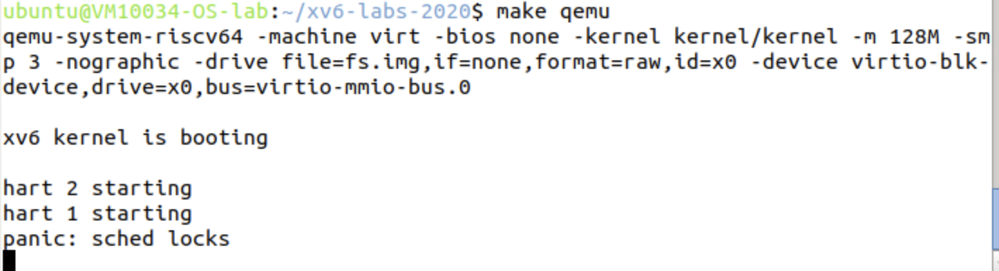

# Lab4 Locks

- **Name**: 胡延伸
- **Student ID**: PB22050983
- **Username for virtual machine**: PB22050983

[TOC]

---

## Memory Allocator

### Experimental Analysis

The purpose of this part of the experiment is to understand and implement memory allocation in the xv6 kernel. Specifically, we focus on how the kernel allocates memory for processes and other internal structures, ensuring efficient use of available memory. We also explore synchronization mechanisms to avoid race conditions when multiple cores allocate or free memory.

This experiment introduces us to the design of low-level memory allocators and the importance of locks to ensure thread safety in multi-core systems.

---

### Experimental Process

1. **Step 1: Analyze the existing memory allocator (`kalloc` and `kfree`)**  

   The memory allocator in xv6 uses a free list to manage free memory pages. Initially, the free pages are linked together in a single list. When a page is allocated, it is removed from the list; when it is freed, it is added back.

   Code Analysis:
   ```c
   void
   freerange(void *pa_start, void *pa_end)
   {
       char *p;
       p = (char*)PGROUNDUP((uint64)pa_start);
       for(; p + PGSIZE <= (char*)pa_end; p += PGSIZE)
           kfree(p);
   }

   void
   kfree(void *pa)
   {
       struct run *r;

       r = (struct run*)pa;
       r->next = kmem.freelist;
       kmem.freelist = r;
   }
   ```

2. **Step 2: Add synchronization to the memory allocator**  

   To ensure thread safety, we add a spinlock to the memory allocator. This prevents race conditions when multiple cores simultaneously allocate or free memory.

   Modified Code:
   ```c
   struct {
       struct spinlock lock;
       struct run *freelist;
   } kmem;

   void
   kinit()
   {
       initlock(&kmem.lock, "kmem");
       freerange(end, (void*)PHYSTOP);
   }

   void
   kfree(void *pa)
   {
       struct run *r;

       acquire(&kmem.lock);
       r = (struct run*)pa;
       r->next = kmem.freelist;
       kmem.freelist = r;
       release(&kmem.lock);
   }

   struct run*
   kalloc(void)
   {
       struct run *r;

       acquire(&kmem.lock);
       r = kmem.freelist;
       if(r)
           kmem.freelist = r->next;
       release(&kmem.lock);
       return r;
   }
   ```

3. **Step 3: Test the memory allocator**  

   After implementing the spinlock, we test the allocator by running `kalloctest`. This ensures that memory allocation and deallocation work correctly in a multi-core environment.

---

## Buffer Cache

### Experimental Analysis

The buffer cache experiment focuses on improving the performance and scalability of xv6's disk buffer management system. The buffer cache stores frequently accessed disk blocks in memory, reducing the number of disk reads and writes. 

In this experiment, the global lock for the buffer cache is replaced with per-bucket locks to reduce contention, allowing multiple cores to access different parts of the buffer cache simultaneously.

---

### Experimental Process

1. **Step 1: Analyze the existing buffer cache implementation**  

   The original buffer cache uses a single global lock for all operations. This creates contention when multiple cores try to access or modify the buffer cache concurrently.

   Original Code:
   ```c
   struct {
       struct spinlock lock;
       struct buf buf[NBUF];
   } bcache;

   void
   binit(void)
   {
       initlock(&bcache.lock, "bcache");
   }

   static struct buf*
   bget(uint dev, uint blockno)
   {
       acquire(&bcache.lock);
       // Search for the buffer
       release(&bcache.lock);
   }
   ```

2. **Step 2: Replace the global lock with per-bucket locks**  

   To reduce contention, I divide the buffer cache into buckets, each protected by its own lock. Buffers are assigned to buckets based on a hash of their device number and block number.

   Modified Code:
   ```c
   #define NBUCKETS 13

   struct bcache_bucket {
       struct spinlock lock;
       struct buf *head;
   };

   struct {
       struct bcache_bucket buckets[NBUCKETS];
   } bcache;

   static int
   hash(uint dev, uint blockno)
   {
       return (blockno + dev) % NBUCKETS;
   }

   void
   binit(void)
   {
       for (int i = 0; i < NBUCKETS; i++) {
           initlock(&bcache.buckets[i].lock, "bcache.bucket");
           bcache.buckets[i].head = 0;
       }
   }

   static struct buf*
   bget(uint dev, uint blockno)
   {
       int idx = hash(dev, blockno);
       struct bcache_bucket *bucket = &bcache.buckets[idx];
       struct buf *b;

       acquire(&bucket->lock);
       for (b = bucket->head; b; b = b->next) {
           if (b->dev == dev && b->blockno == blockno) {
               b->refcnt++;
               release(&bucket->lock);
               acquiresleep(&b->lock);
               return b;
           }
       }
       release(&bucket->lock);
       return 0;
   }
   ```

3. **Step 3: Modify `brelse` to work with per-bucket locks**  

   Buffers are now released back to their respective buckets, and the appropriate bucket lock is used.

   Modified Code:
   ```c
   void
   brelse(struct buf *b)
   {
       int idx = hash(b->dev, b->blockno);
       struct bcache_bucket *bucket = &bcache.buckets[idx];

       acquire(&bucket->lock);
       b->refcnt--;
       release(&bucket->lock);
   }
   ```

4. **Step 4: Test the buffer cache implementation**  

   Run `bcachetest` to verify that the buffer cache is functioning correctly and that contention is reduced. Debugging with `printf` statements ensures that buffers are being accessed and released properly.

---

## Experimental Grading

I passed the test of the first assginment **Memory allocator**. But I forgot to take the screenshot and then directly got down to the next assignment **Buffer cache**. But after a long period of debugging, I still couldn't fix the errors, the xv6 system got stuck like below:



And due to above reason, the normal grading for the first assignment failed. The score below is extremely low:


---

## Experimental Summary

This lab deepened my understanding of locks and synchronization in operating systems. I learned how to identify bottlenecks caused by global locks and how to use fine-grained locking to improve performance. Specifically, the buffer cache experiment taught me how to design and implement scalable systems by dividing shared resources into smaller units, each protected by its own lock.

