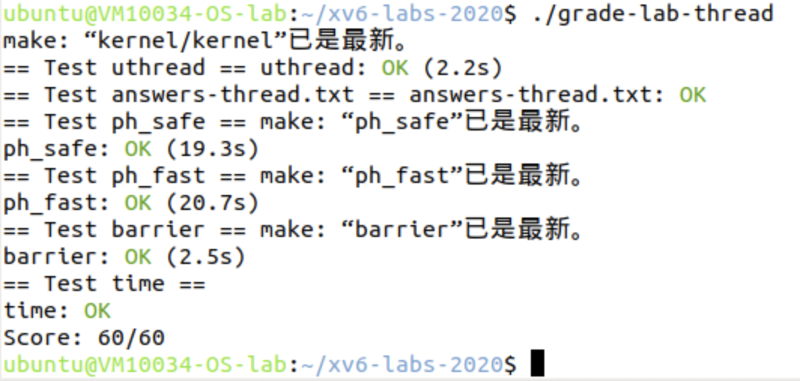

# Lab3 Multithreading

<center><big><b>PB22050983 胡延伸</b></big></center>

- Name: 胡延伸
- StudentID: PB22050983
- Virtual machine user name: ubuntu@VM10034-OS-lab

## Uthread: switching between threads

### Experimental analysis
This experiment implements a basic user-level thread switching mechanism. The key challenge is maintaining thread execution state during switches.

1. What needs to be saved:
   - Return address (ra): Records where to continue execution
   - Stack pointer (sp): Essential for thread's stack operations
   - Saved registers (s0-s11): Preserve thread's local variables
2. Thread Creation Steps:
   - Allocate stack space for new thread
   - Set stack pointer near top of allocated space
   - Store thread function address in ra register
   - Initialize saved registers to 0
3.  Context Switch Process:
    - Save current thread's registers to its context
    - Load next thread's registers from its context
    - Switch stack pointers between threads
    - Return to saved program counter


### Experimental process

1. Add the context structure in the uthread.c
```c
struct thread {
  char stack[STACK_SIZE];   
  int state;                 
  
  struct context {
    uint64 ra;
    uint64 sp;
    uint64 s0;
    uint64 s1;
    uint64 s2;
    uint64 s3;
    uint64 s4;
    uint64 s5;
    uint64 s6;
    uint64 s7;
    uint64 s8;
    uint64 s9;
    uint64 s10;
    uint64 s11;
  } context;
};
```
2. thread_create():
```c
void 
thread_create(void (*func)())
{
  struct thread *t;

  // Find a free thread slot
  for (t = all_thread; t < all_thread + MAX_THREAD; t++) {
    if (t->state == FREE) break;
  }
  
  // Initialize the thread
  t->state = RUNNABLE;
  
  // Set up the initial stack frame
  t->context.sp = (uint64)(t->stack + STACK_SIZE);  // Point to top of stack
  t->context.ra = (uint64)func;                     // Set return address to function
  t->context.s0 = (uint64)(t->stack + STACK_SIZE);  // Set frame pointer
}
```
3. Complement `thread_schedule()` function:
```c
void 
thread_schedule(void)
{
  struct thread *t, *next_thread;

  /* Find another runnable thread. */
  next_thread = 0;
  t = current_thread;
  do {
    t = t + 1;
    if (t >= all_thread + MAX_THREAD)
      t = all_thread;
    if (t->state == RUNNABLE) {
      next_thread = t;
      break;
    }
  } while(t != current_thread);

  if (next_thread == 0) {
    printf("thread_schedule: no runnable threads\n");
    exit(-1);
  }

  if (current_thread != next_thread) {
    next_thread->state = RUNNING;
    t = current_thread;
    current_thread = next_thread;
    thread_switch((uint64)&t->context, (uint64)&next_thread->context);
  }
}
```
4. Create `uthread_switch.S`:
```c
.text

.globl thread_switch
thread_switch:
    # a0 = old thread's context
    # a1 = new thread's context
    
    # Save old thread's registers
    sd ra, 0(a0)
    sd sp, 8(a0)
    sd s0, 16(a0)
    sd s1, 24(a0)
    sd s2, 32(a0)
    sd s3, 40(a0)
    sd s4, 48(a0)
    sd s5, 56(a0)
    sd s6, 64(a0)
    sd s7, 72(a0)
    sd s8, 80(a0)
    sd s9, 88(a0)
    sd s10, 96(a0)
    sd s11, 104(a0)

    # Load new thread's registers
    ld ra, 0(a1)
    ld sp, 8(a1)
    ld s0, 16(a1)
    ld s1, 24(a1)
    ld s2, 32(a1)
    ld s3, 40(a1)
    ld s4, 48(a1)
    ld s5, 56(a1)
    ld s6, 64(a1)
    ld s7, 72(a1)
    ld s8, 80(a1)
    ld s9, 88(a1)
    ld s10, 96(a1)
    ld s11, 104(a1)
    
    ret
```
## Using threads

### Experimental analysis
This experiment focuses on implementing thread-safe hash table operations using locks.

For ph_safe:
Add single global lock for all operations

For ph_fast:
Create array of locks, one per bucket


### Experimental process

### ph_safe

1. Implement mutex lock
```c
pthread_mutex_t lock;

// Initialize locks in main
pthread_mutex_init(&lock, NULL);
```

2. Modify put and get functions with proper locking
```c
static void 
put(int key, int value)
{
    int i = key % NBUCKET;
    pthread_mutex_lock(&locks[i]);
    insert(key, value, &table[i]->next, table[i]->next);
    pthread_mutex_unlock(&locks[i]);
}

static struct entry*
get(int key)
{
    int i = key % NBUCKET;
    pthread_mutex_lock(&lock);
    struct entry *e = 0;
    for (e = table[i]->next; e != 0; e = e->next) {
        if (e->key == key) {
            break;
        }
    }
    pthread_mutex_unlock(&lock);
    return e;
}
```
3. Add proper initialization
```c
int
main (){
    pthread_mutex_init(&lock, NULL);
    for(int i = 0; i < NBUCKET; i++) {
        table[i] = malloc(sizeof(struct entry));
        table[i]->next = NULL;
    }
    /* the rest of codes */
}
```

### ph_fast
1. Implement mutex lock
```c
pthread_mutex_t lock;

// Initialize locks in main
for(int i = 0; i < NBUCKET; i++) {
    pthread_mutex_init(&locks[i], NULL);
}
```

2. Modify put and get functions with proper locking
```c
static void 
put(int key, int value)
{
    int i = key % NBUCKET;
    pthread_mutex_lock(&locks[i]);
    insert(key, value, &table[i]->next, table[i]->next);
    pthread_mutex_unlock(&locks[i]);
}

static struct entry*
get(int key)
{
    int i = key % NBUCKET;
    pthread_mutex_lock(&locks[i]);
    struct entry *e = 0;
    for (e = table[i]->next; e != 0; e = e->next) {
        if (e->key == key) {
            pthread_mutex_unlock(&locks[i]);
            return e;
        }
    }
    pthread_mutex_unlock(&locks[i]);
    return e;
}
```
3. Add proper initialization
```c
int 
main() {
    for(int i = 0; i < NBUCKET; i++) {
        pthread_mutex_init(&locks[i], NULL);
        table[i] = malloc(sizeof(struct entry));
        table[i]->next = NULL;
    }
    /* the rest of the codes */
}
```


## Barrier

### Experimental analysis

1. State Tracking:
   - Count of arrived threads
   - Current round number
   - Thread blocking mechanism

2. Round Management:
   - Block threads when count < total
   - Wake all threads when last arrives
   - Increment round number
   - Reset thread count

3. Race Prevention:
   - Track current round number
   - Save round number on entry
   - Verify round hasn't changed
   - Handle fast threads in next round


### Experimental process

1. Barrier structure and initialization
```c
struct barrier {
    pthread_mutex_t barrier_mutex;
    pthread_cond_t barrier_cond;
    int nthread;
    int count;
    int round;
} bstate;

static void barrier_init(void)
{
    assert(pthread_mutex_init(&bstate.barrier_mutex, NULL) == 0);
    assert(pthread_cond_init(&bstate.barrier_cond, NULL) == 0);
    bstate.nthread = nthread;
    bstate.count = 0;
    bstate.round = 0;
}
```

1. Barrier synchronization 
```c
static void barrier()
{
    pthread_mutex_lock(&bstate.barrier_mutex);
    
    int current_round = bstate.round;
    bstate.count++;
    
    if (bstate.count == bstate.nthread) {
        bstate.count = 0;
        bstate.round++;
        pthread_cond_broadcast(&bstate.barrier_cond);
    } else {
        while (current_round == bstate.round) {
            pthread_cond_wait(&bstate.barrier_cond, &bstate.barrier_mutex);
        }
    }
    
    pthread_mutex_unlock(&bstate.barrier_mutex);
}
```

## Experimental scoring


## Experimental summary
Through this lab, I gained practical experience with:
1. Low-level thread context switching mechanisms
2. Proper synchronization techniques using mutexes and condition variables
3. Race condition prevention and fine-grained locking
4. Performance optimization in multi-threaded applications

The most challenging part was implementing the barrier synchronization, which required careful handling of thread coordination and race conditions. The lab helped reinforce theoretical concepts with practical implementation experience.