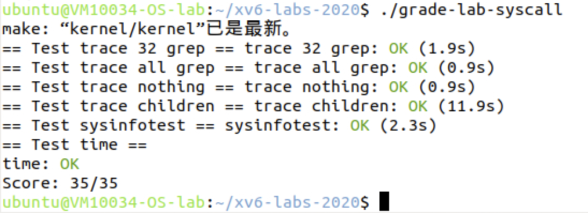

# Lab2 system calls

<center><big><b>PB22050983 胡延伸</b></big></center>

- Name: 胡延伸
- StudentID: PB22050983
- Virtual machine username: ubuntu@VM10034-OS-lab

[TOC]

## System call tracing

### Experimental analysis
The trace system call addition requires modifications at both user and kernel levels: 
1. When a process calls trace(mask), it sets a trace mask in the process structure
2. The mask is a bit vector where each bit corresponds to a system call number
3. When any system call occurs, the kernel checks if that call's bit is set in the mask
4. If set, the kernel prints the process ID, system call name, and return value

### Experimental process

1. Add system call number definition
```c
// kernel/syscall.h
#define SYS_trace   22
```

2. Add trace system call prototype to user space
```c
// user/user.h
int trace(int);
```

3. Add system call handler
```c
// kernel/sysproc.c
uint64
sys_trace(void)
{
  int mask;
  if(argint(0, &mask) < 0)
    return -1;
  myproc()->trace_mask = mask;
  return 0;
}
```

4. Modify syscall() to print trace information
```c
// kernel/syscall.c
void
syscall(void)
{
  int num;
  struct proc *p = myproc();

  num = p->trapframe->a7;
  if(num > 0 && num < NELEM(syscalls) && syscalls[num]) {
    p->trapframe->a0 = syscalls[num]();
    if(p->trace_mask & (1 << num)) {
      printf("%d: syscall %s -> %d\n", 
             p->pid, syscall_names[num], p->trapframe->a0);
    }
  } else {
    printf("%d %s: unknown sys call %d\n",
            p->pid, p->name, num);
    p->trapframe->a0 = -1;
  }
}
```

## Sysinfo

### Experimental analysis
The sysinfo system call collects system statistics and returns them to user space:

1. User provides a pointer to struct sysinfo
2. Kernel collects two pieces of information:
   - Free memory: Count free pages in memory free list
   - Process count: Count processes not in UNUSED state
3. Kernel safely copies this information back to user space
### Experimental process

1. Define sysinfo structure and system call number
```c
// kernel/sysinfo.h
struct sysinfo {
  uint64 freemem;   // amount of free memory (in bytes)
  uint64 nproc;     // number of processes
};

// kernel/syscall.h
#define SYS_sysinfo 23
```

2. Implement helper functions
```c
// kernel/kalloc.c
uint64
getfreemem(void)
{
  struct run *r;
  uint64 free_mem = 0;
  
  acquire(&kmem.lock);
  r = kmem.freelist;
  while(r) {
    free_mem += PGSIZE;
    r = r->next;
  }
  release(&kmem.lock);
  
  return free_mem;
}

// kernel/proc.c
uint64
getnproc(void)
{
  struct proc *p;
  uint64 n = 0;

  for(p = proc; p < &proc[NPROC]; p++) {
    if(p->state != UNUSED)
      n++;
  }
  return n;
}
```

3. Implement system call handler
```c
// kernel/sysproc.c
uint64
sys_sysinfo(void)
{
  uint64 addr;
  struct sysinfo info;
  struct proc *p = myproc();

  if(argaddr(0, &addr) < 0)
    return -1;

  info.freemem = getfreemem();
  info.nproc = getnproc();

  if(copyout(p->pagetable, addr, (char *)&info, sizeof(info)) < 0)
    return -1;

  return 0;
}
```

## Experimental scoring


## Experimental summary
Through this lab, I gained practical experience implementing system calls in xv6. I learned about:
- System call mechanism in xv6
- Process management and memory management
- Safe copying between kernel and user space
- System resource monitoring
- The importance of proper error handling in system calls

The lab helped reinforce my understanding of operating system concepts and gave me hands-on experience with kernel programming.
