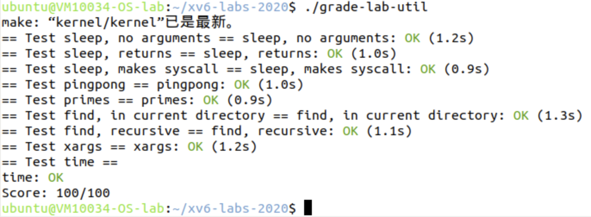

# Lab1 Utils

<center><big><b>PB22050983 胡延伸</b></big></center>

- Name: 胡延伸
- StudentID: PB22050983
- 虚拟机用户名: ubuntu@VM10034-OS-lab


[TOC]

## sleep

### Experimental analysis

The sleep utility is a simple program that delays for a specified number of ticks (timer interrupts). This experiment teaches basic system call `sleep()` usage in xv6 and argument parsing from the command line.

### Experimental process

The implementation requires:

1. Parsing the command line argument for sleep duration
2. Converting the string argument to an integer
3. Calling the sleep system call

```c
#include "kernel/types.h"
#include "kernel/stat.h"
#include "user/user.h"

int main(int argc, char *argv[]) {
    if(argc != 2) {
        fprintf(2, "Usage: sleep <ticks>\n"); 
        //writes to file descriptor 2, \
        which is stderr (standard error)
        exit(1);
    }
    
    int ticks = atoi(argv[1]);
    sleep(ticks);
    exit(0);
}
```

## pingpong

### Experimental analysis

The pingpong utility demonstrates inter-process communication using pipes. Parent and child processes exchange a byte using two pipes, one for parent2child writing and reading, and the other for child2parent. `fork()`, `read`, `write()`, `pipe()`, and `getpid()` are involved in completing the task.

### Experimental process

Implementation involves:
1. Creating two pipes for bidirectional communication
2. Forking a child process
3. Parent sends "ping", waits for "pong"
4. Child receives "ping", sends "pong"

```c
#include "kernel/types.h"
#include "kernel/stat.h"
#include "user/user.h"

int main(int argc, char *argv[])
{
    int p2c[2];  // pipe parent to child
    int c2p[2];  // pipe child to parent
    char buf[1];
    
    // Create two pipes
    if (pipe(p2c) < 0 || pipe(c2p) < 0) {
        fprintf(2, "pipe creation failed\n");
        exit(1);
    }

    int pid = fork();
    if (pid < 0) {
        fprintf(2, "fork failed\n");
        exit(1);
    }

    if (pid == 0) {  // child process
        close(p2c[1]);  // close write end of parent to child pipe
        close(c2p[0]);  // close read end of child to parent pipe

        // Read byte from parent
        if (read(p2c[0], buf, 1) != 1) {
            fprintf(2, "child read failed\n");
            exit(1);
        }
        printf("%d: received ping\n", getpid());

        // Send byte back to parent
        if (write(c2p[1], buf, 1) != 1) {
            fprintf(2, "child write failed\n");
            exit(1);
        }

        close(p2c[0]);
        close(c2p[1]);
        exit(0);
    } else {  // parent process
        close(p2c[0]);  // close read end of parent to child pipe
        close(c2p[1]);  // close write end of child to parent pipe

        // Send byte to child
        buf[0] = 'P';
        if (write(p2c[1], buf, 1) != 1) {
            fprintf(2, "parent write failed\n");
            exit(1);
        }

        // Read byte from child
        if (read(c2p[0], buf, 1) != 1) {
            fprintf(2, "parent read failed\n");
            exit(1);
        }
        printf("%d: received pong\n", getpid());

        close(p2c[1]);
        close(c2p[0]);
        wait(0);  // wait for child to exit
        exit(0);
    }
}
```

## primes

### Experimental analysis
The prime sieve utility implements concurrent prime number generation using pipes. The sieve can be simulated by a pipeline of processes executing the following:
```Python
p = get a number from left neighbor
print p
loop:
    n = get a number from left neighbor
    if (p does not divide n)
        send n to right neighbor
```

To build the sieve, we should use `fork()` to build parent and child processes:
- In child process, we should recursively call the sieve process to create the right neighbour.
- In parent process, we should keep sending new numbers to the right neighbour.

### Experimental process
The implementation involves:
1. Create the sieve:
   1. Pipeline of processes to filter composite numbers using recurrence
   ```c
   // Create pipe for right neighbor
    int right_pipe[2];
    pipe(right_pipe);
    
    if (fork() == 0) {
        // Child process
        close(right_pipe[1]);    // Close write end of right pipe
        close(left_pipe[0]);     // Close read end of left pipe
        sieve(right_pipe);       // Recursive call with new left pipe
    }
    ```
    2. Print the prime and send the proper number to the right neighbor:
    ```c
    int p;
    // Read first number (prime) from left neighbor
    if (read(left_pipe[0], &p, sizeof(int)) == 0) {
        close(left_pipe[0]);
        exit(0);
    }
    
    printf("prime %d\n", p);

    /* intermediate codes */

    // Parent process
    close(right_pipe[0]);    // Close read end of right pipe
    
    int n;
    // Keep reading numbers from left pipe
    while (read(left_pipe[0], &n, sizeof(int)) > 0) {
        // If n is not divisible by p, send it to right neighbor
        if (n % p != 0) {
            write(right_pipe[1], &n, sizeof(int));
        }
    }
    
    close(left_pipe[0]);     // Close read end of left pipe
    close(right_pipe[1]);    // Close write end of right pipe
    wait(0);                 // Wait for child to finish
    exit(0);
    ```

2. Recursive process creation for each prime number
    ```c
    if (fork() == 0) {
        // Child process
        close(first_pipe[1]);    // Close write end
        sieve(first_pipe);       // Start sieve with first pipe
    } else {
        // Parent process
        close(first_pipe[0]);    // Close read end
        
        // Feed numbers 2 through 35 into the pipeline
        for (int i = 2; i <= 35; i++) {
            write(first_pipe[1], &i, sizeof(int));
        }
        
        close(first_pipe[1]);    // Close write end
        wait(0);                 // Wait for all processes to finish
        exit(0);
    }
    ```


## find

### Experimental analysis
The find utility recursively searches directories for files with a specific name. 

- The program implements depth-first search through the directory structure:
  - Processes current entry
  - If directory, recursively searches its contents
  - Maintains proper path construction throughout

- To print the path, we should dynamically manage the path:
  - Dynamically builds full paths for each entry
  - Handles path concatenation with proper separators
  - Checks for buffer overflow conditions

- Handles special directory entries:
  - Skips empty entries
  - Ignores "." (current directory)
  - Ignores ".." (parent directory)

### Experimental process

1. Directory traversal using system calls
    ```c
    if((fd = open(path, 0)) < 0){
        fprintf(2, "find: cannot open %s\n", path);
        return;
    }

    if(fstat(fd, &st) < 0){
        fprintf(2, "find: cannot stat %s\n", path);
        close(fd);
        return;
    }
    ```
2. File processing:
    ```c
    case T_FILE:
    if(strcmp(fmtname(path), filename) == 0){
        printf("%s\n", path);
    }
    break;
    ```
3. Recursive search through subdirectories
   1. Check path length limits:
        ```c
        if(strlen(path) + 1 + DIRSIZ + 1 > sizeof buf){
            printf("find: path too long\n");
            break;
        }
        ```
    2. Directory entry processing:
        ```c
        strcpy(buf, path);
        p = buf+strlen(buf);
        *p++ = '/';
        while(read(fd, &de, sizeof(de)) == sizeof(de)){
            if(de.inum == 0)
                continue;
            if(strcmp(de.name, ".") == 0 || strcmp(de.name, "..") == 0)
                continue;
            memmove(p, de.name, DIRSIZ);
            p[DIRSIZ] = 0;
            if(stat(buf, &st) < 0){
                printf("find: cannot stat %s\n", buf);
                continue;
            }
            find(buf, filename);  // Recursive call for subdirectories
        }
        break;
        ```

## xargs

### Experimental analysis
The xargs utility reads lines from standard input and executes commands with those lines as arguments. 

- Program receives a command and its arguments
- To execute the commands, we keep using `fork()`:
    ```
    Parent xargs
        │
        ├── Child 1 (executes command with first line)
        │   └── (waits for completion)
        ├── Child 2 (executes command with second line)
        │   └── (waits for completion)
        └── ... continues for each input line
    ```

### Experimental process

1. Argument preparation:
   ```c
   // Copy command and its arguments to new_argv
    for(int i = 1; i < argc; i++){
        new_argv[i-1] = argv[i];
    }
    ```

2. Reading input line by line
    ```c
    //while(1){
    int i = 0;
    // Read until newline or EOF, character by character
    while(i < MAXLINE - 1){
        n = read(0, &line[i], 1);
        if(n <= 0 || line[i] == '\n'){
            break;
        }
        i++;
    }
    
    if(i == 0 && n <= 0) break;  // EOF with no data
    
    line[i] = 0;  // Null terminate the line
    ```
3. Command Execution:
    ```c
    // Set up the last argument as the line we just read
    new_argv[argc-1] = line;
    new_argv[argc] = 0;  // Null terminate argv
    // Fork and execute the command
    int pid = fork();
    if(pid == 0){
        // Child process
        exec(new_argv[0], new_argv);
        fprintf(2, "xargs: exec %s failed\n", new_argv[0]);
        exit(1);
    } else if(pid > 0){
        // Parent process
        wait(0);
    } else {
        fprintf(2, "xargs: fork failed\n");
        exit(1);
    }
    ```

## Experimental scoring



## Experimental summary

This lab provided practical experience with:
- System call usage in xv6
- Process management and IPC
- File system operations
- Command-line argument handling
- Shell utility implementation

Key learnings:
1. Understanding Unix pipeline concepts
2. Managing file descriptors properly
3. Process creation and synchronization
4. Directory traversal and file operations
5. Error handling in system programming

