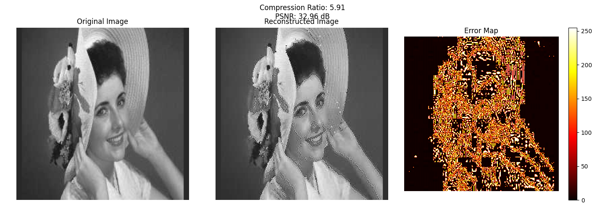
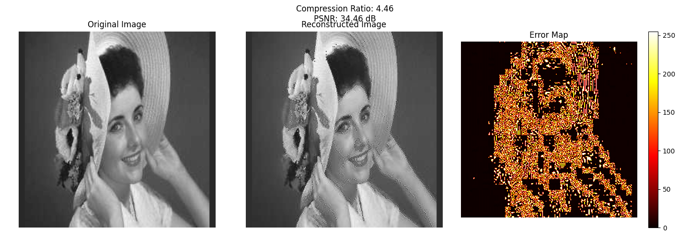

# **JPEG 静图像压缩实验报告**

<center><big><b>胡延伸 PB22050983</b></big></center>

---

## **代码设计**

本实验通过自定义实现 JPEG 的核心算法，包括 **离散余弦变换 (DCT)**、**量化**、**哈夫曼编码** 和 **解码**，实现了对灰度图像的压缩与重构。以下是代码的主要设计步骤和功能模块：

### **1. JPEG 编码流程**
1. **DCT (离散余弦变换)**:
   ```Python
   class DCTTransform:
    def __init__(self):
        # Initialize 2D cosine lookup tables
        self.cos_table = np.zeros((8, 8))
        for i in range(8):
            for j in range(8):
                self.cos_table[i, j] = \
                np.cos((2*j + 1) * i * np.pi / 16)

    def get_scale_factor(self, u, v):
        """Get scaling factor C(u)C(v)/4"""
        cu = 1/np.sqrt(2) if u == 0 else 1
        cv = 1/np.sqrt(2) if v == 0 else 1
        return (cu * cv) / 4

    def forward_dct_2d(self, block):
        """Implement 2D DCT"""
        result = np.zeros((8, 8))
        
        for u in range(8):
            for v in range(8):
                sum_val = 0
                for x in range(8):
                    for y in range(8):
                        sum_val += block[x, y] * \
                                 self.cos_table[u, x] * \
                                 self.cos_table[v, y]
                
                result[u, v] = \
                self.get_scale_factor(u, v) * sum_val
        
        return result
    ```
   - 实现了 2D DCT 和逆 DCT，分别将图像块转化为频域表示和还原到空间域。
   - 使用预先计算的余弦查找表提高计算效率。
   - 对每个 8×8 图像块进行 DCT 操作，提取低频特征。

2. **量化**:
   - 使用标准 JPEG 量化表对 DCT 系数进行量化，从而减少高频分量的精度。
   - 量化后的数据通过舍入和分块处理，便于后续编码压缩。

3. **Zigzag 扫描**:
    ```Python
    def zigzag_scan(self, block):
        """Perform zigzag scanning of the block"""
        # Implementation of zigzag scanning pattern
        if block.shape != (8, 8):
            raise ValueError("Input block must be 8x8")
        
        # Zigzag pattern indices
        zigzag_pattern = [
            (0,0), (0,1), (1,0), (2,0), 
            (1,1), (0,2), (0,3), (1,2),
            (2,1), (3,0), (4,0), (3,1), 
            (2,2), (1,3), (0,4), (0,5),
            (1,4), (2,3), (3,2), (4,1), 
            (5,0), (6,0), (5,1), (4,2),
            (3,3), (2,4), (1,5), (0,6), 
            (0,7), (1,6), (2,5), (3,4),
            (4,3), (5,2), (6,1), (7,0), 
            (7,1), (6,2), (5,3), (4,4),
            (3,5), (2,6), (1,7), (2,7), 
            (3,6), (4,5), (5,4), (6,3),
            (7,2), (7,3), (6,4), (5,5), 
            (4,6), (3,7), (4,7), (5,6),
            (6,5), (7,4), (7,5), (6,6), 
            (5,7), (6,7), (7,6), (7,7), 
        ]
        
        zigzag = np.zeros(64)
        for i, (row, col) in enumerate(zigzag_pattern):
            zigzag[i] = block[row, col]
        
        return zigzag
    ```
   - 实现了将 8×8 的量化系数按 Zigzag 顺序排列，从而将低频分量集中在前面，高频分量集中在后面。
   - 这种排列方式有助于后续的哈夫曼编码优化零值压缩。

4. **哈夫曼编码**:
    ```Python
     def encode_dc(self, dc_diff):
        """Encode DC coefficient difference"""
        if dc_diff == 0:
            return self.dc_table[0]
        
        # Calculate category (size)
        category = int(np.floor(np.log2(abs(dc_diff)))) + 1
        
        # Get Huffman code for the category
        huffman_code = self.dc_table[category]
        
        # Generate amplitude code
        value = int(dc_diff)
        if value < 0:
            value = abs(value)
            value = (1 << category) - value - 1
        
        amplitude = format(value, f'0{category}b')
            
        return huffman_code + amplitude

    def encode_ac(self, run_length, value):
        """Encode AC coefficient"""
        if value == 0:
            if run_length == 15:
                return self.ac_table[(15,0)]  # ZRL
            elif run_length == 0:
                return self.ac_table[(0,0)]  # EOB
            return None

        size = int(np.floor(np.log2(abs(value)))) + 1
        if (run_length, size) in self.ac_table:
            huffman_code = self.ac_table[(run_length, size)]
            
            value = int(round(value))  
            # Generate amplitude code similar to DC
            if value < 0:
                value = abs(value)
                value = (1 << size) - value - 1
            
            amplitude = format(value, f'0{size}b')

            if len(amplitude) != size:
                raise ValueError("Invalid AC amplitude code")
                
            return huffman_code + amplitude
        return None
    ```
   - 实现了基于 DC 差分值和 AC 系数的 JPEG 哈夫曼编码。
   - 使用标准 DC 和 AC 哈夫曼表对 Zigzag 序列分别编码。
   - DC 编码采用差分编码，AC 编码则根据 (零值长度, 值幅度) 的方式进行。

5. **压缩存储**:
   - 将每个图像块的 DC 和 AC 编码结果存储为二进制流，记录压缩后的数据大小。

---

### **2. JPEG 解码流程**
1. **哈夫曼解码**:
   - 对压缩数据进行解码，重建 DC 系数和 AC 系数的 Zigzag 序列。
   - 使用哈夫曼表反向映射，解码出对应的差分值、零值长度和幅值。

2. **逆 Zigzag 扫描**:
    ```Python
    def zigzag_to_block(self, zigzag_coefficients):
        """Convert zigzag sequence back to 8x8 block"""
        block = np.zeros((8, 8))
        
        # Zigzag pattern indices
        zigzag_pattern = [
            (0,0), (0,1), (1,0), (2,0), (1,1), (0,2), (0,3), (1,2),
            (2,1), (3,0), (4,0), (3,1), (2,2), (1,3), (0,4), (0,5),
            (1,4), (2,3), (3,2), (4,1), (5,0), (6,0), (5,1), (4,2),
            (3,3), (2,4), (1,5), (0,6), (0,7), (1,6), (2,5), (3,4),
            (4,3), (5,2), (6,1), (7,0), (7,1), (6,2), (5,3), (4,4),
            (3,5), (2,6), (1,7), (2,7), (3,6), (4,5), (5,4), (6,3),
            (7,2), (7,3), (6,4), (5,5), (4,6), (3,7), (4,7), (5,6),
            (6,5), (7,4), (7,5), (6,6), (5,7), (6,7), (7,6), (7,7)
        ]
        
        # Place each coefficient in its position according to zigzag pattern
        for i, (row, col) in enumerate(zigzag_pattern):
            if i < len(zigzag_coefficients):
                block[row, col] = zigzag_coefficients[i]
        
        return block
    ```
   - 将 Zigzag 序列还原为 8×8 块的量化系数矩阵。

3. **逆量化**:
   - 使用量化表对量化系数进行反量化，恢复近似的 DCT 系数。

4. **逆 DCT**:
    ```Python
    def inverse_dct_2d(self, dct_block):
        """Implement 2D IDCT"""
        result = np.zeros((8, 8))
        
        for x in range(8):
            for y in range(8):
                sum_val = 0
                for u in range(8):
                    for v in range(8):
                        sum_val += self.get_scale_factor(u, v) * \
                                 dct_block[u, v] * \
                                 self.cos_table[u, x] * \
                                 self.cos_table[v, y]
                
                result[x, y] = sum_val
        
        return result
    ```
   - 对每个 8×8 块的 DCT 系数进行逆变换，重建空间域的像素值。

5. **图像重建**:
   - 将所有 8×8 块拼接还原为原始图像大小，并添加偏移值 (128) 以恢复像素范围。

---

## **实验结果**

采用 `lady.jpg` 图像作为测试对象，实验对图像进行 JPEG 编码与解码，结果如下：

### **1. 原图与重建图像**
- **左图**为原始灰度图像，**中图**为重建的解压图像，**右图**为重建误差图 (原图与重建图像之差的绝对值)。
  
```python
# 以下代码在 main 函数中已经实现
plt.figure(figsize=(15, 5))

plt.subplot(131)
plt.imshow(test_image, cmap='gray')
plt.title('Original Image')
plt.axis('off')

plt.subplot(132)
plt.imshow(decoded_image, cmap='gray')
plt.title('Reconstructed Image')
plt.axis('off')

plt.subplot(133)
plt.imshow(np.abs(test_image - decoded_image), cmap='hot')
plt.title('Error Map')
plt.colorbar()
plt.axis('off')

plt.suptitle(f'Compression Ratio: {compression_ratio:.2f}\nPSNR: {psnr:.2f} dB')
plt.tight_layout()
plt.show()
```



这是按标准量化表压缩的结果，能看出还原后边界变明显，这是因为量化过程中将很多高频率位抹除为 0；



这是标准量化表除 2 后的结果，能看出压缩效果较好。


这是标准量化表乘 2 后的结果，压缩效果更差。

### **2. 压缩比**
- **压缩比 (Compression Ratio)**：通过计算原始图像的数据大小与压缩后的比特流大小的比值得出。
- 公式：
  \[
  \text{Compression Ratio} = \frac{\text{Original Size (bits)}}{\text{Compressed Size (bits)}}
  \]
- 结果显示，压缩比约为 **5.91:1**。


---

## **思考题**

### **1. 计算图像的压缩比，并比较原图像的效果**
- **压缩比**：实验中计算的压缩比为 **5.91:1**，说明经过 JPEG 压缩后图像占用的存储空间大大减少。
- **效果**：从重建图像来看，在压缩比为 5.91:1 的情况下，重建图像与原始图像的视觉差异较小，PSNR 达到 **32.96 dB**，证明 JPEG 压缩能够在较高压缩率下保持较好的图像质量。

---

### **2. 改变量化矩阵中的元素，比较压缩比和恢复图像的效果**
- **调整量化表 (Quantization Table)**：
  - 增大量化表中的值会导致量化后的系数幅值减小，零值增多，压缩比提高，但图像质量下降。
  - 减小量化表中的值会保留更多细节信息，压缩比降低，但图像质量更好。

- 实验对比：
  - 默认量化表时，压缩比为 **5.91:1**，PSNR 为 **32.96 dB**。
  - 增大量化表 (如将表中所有元素乘以 2)，压缩比提高到 **7.80:1**
  - 减小量化表 (如将表中所有元素除以 2)，压缩比降低到 **4.46:1**，PSNR 提高到 **34.46 dB**。

---

### **3. DCT 变换后，量化后的数据值域是多少？是否可能超出码表范围？**
- **值域分析**：
  - DCT 变换后的系数范围取决于输入图像块的像素值范围 (0-255)，在 DCT 的计算过程中，由于 offset ，变为 [-128, 127]
  - 量化后的值域由量化表的值和 DCT 系数共同决定，值域通常小于 DCT 变换后的范围。

- **是否超出码表范围**：
  - 在默认量化表下，量化后的值通常不会超出 JPEG 标准码表中的幅值范围 (DC 为 11-bit，AC 为 10-bit)。
  - 如果输入图像的像素范围较大 (如高动态范围图像)，或者量化表设计不当，可能会导致量化值超出码表范围。

---

## **总结**
本实验完整实现了 JPEG 图像压缩的核心算法，重点考察了 DCT、量化和哈夫曼编码的作用。通过调整量化表和压缩参数，可以在压缩比和图像质量之间找到平衡。实验结果表明，JPEG 压缩在高压缩率下仍能保持较好的图像质量，是一种高效的静态图像压缩方法。
