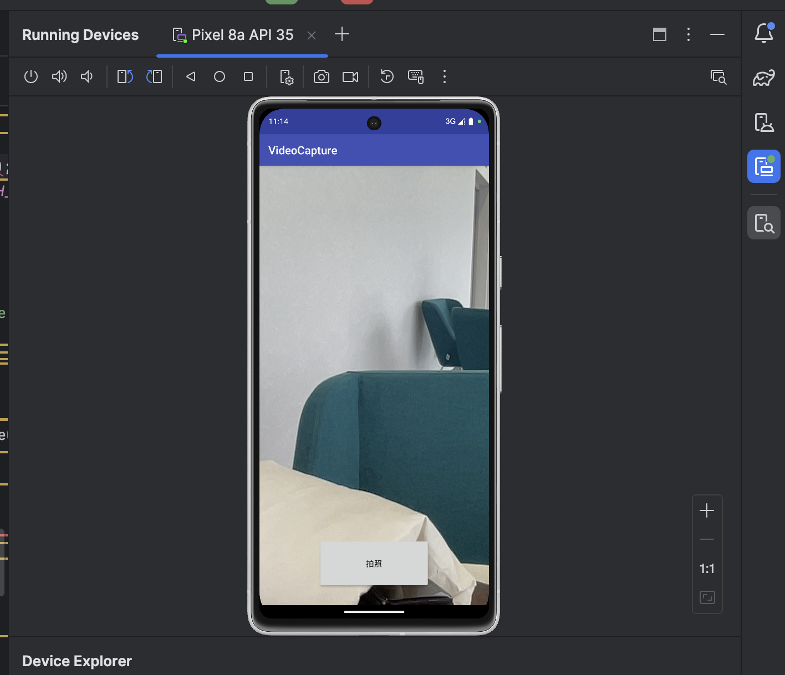
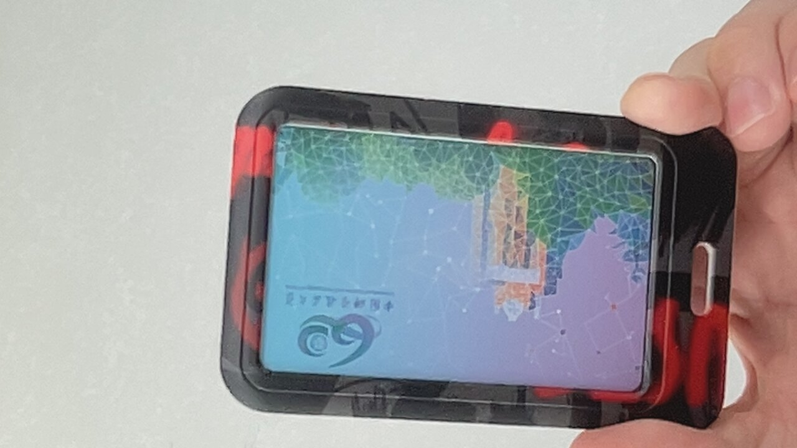
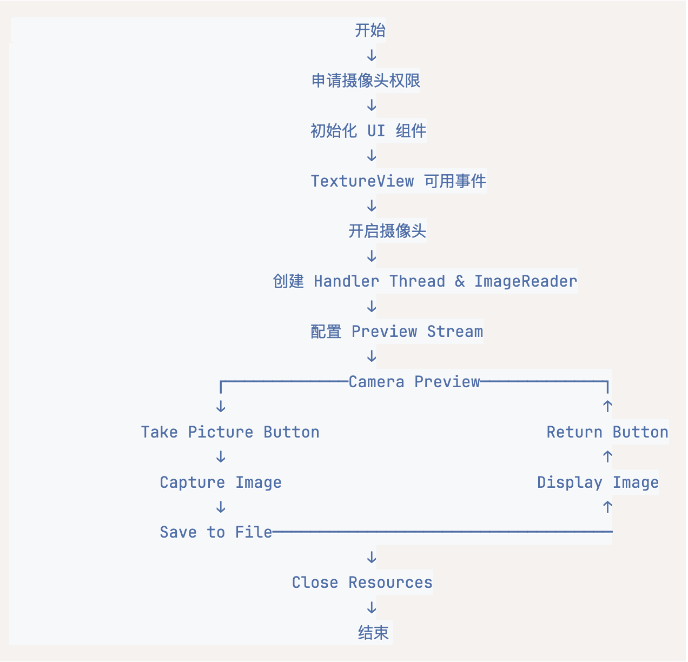

# Android 下的摄像头编程实验报告

<center><big><b>PB22050983 胡延伸</b></big></center>

## 实验目的

- 学习 Android 下进行摄像头控制的基本方法。
- 理解回调函数。

## 实验原理

### android.hardware

android.hardware 包下面包含了如摄像头、传感器等硬件的支持。

### android.hardware.Camera 类

使用 Android 设备的摄像头（照相机）需要设备访问权限在 AndroidManifest.xml 文件中的对应描述如下：

```xml
<uses-permission android:name="android.permission.CAMERA" />
<uses-feature android:name="android.hardware.camera" />
<uses-feature android:name="android.hardware.camera.autofocus" />
```

### Camera2 类说明

Android 5.0(SDK 21)之后 android.hardware.Camera 就被废弃了，取而代之的是全新的android.hardware.Camera2 。Android 5.0 对拍照 API 进行了全新的设计，新增了全新设计的Camera v2 API，这些 API 不仅大幅提高了 Android 系统拍照的功能，还能支持 RAW 照片输出，甚至允许程序调整相机的对焦模式、曝光模式、快门等.

### android.hardware.ImageReader 类

与播放声音不同，在使用摄像头的时候，我们需要把摄像头捕获的图像进行显示。示例程序中使用 ImageReader 类完成摄像头捕获的图像数据到界面上显示控件的显示。类ImageReader 支持图像数据的着色（The ImageReader class allows direct application access to image data rendered into a Surface）。

### 回调函数

回调函数就是一个通过函数指针调用的函数。如果你把函数的指针（地址）作为参数传递给另一个函数，当这个指针被用来调用其所指向的函数时，我们就说这是回调函数。回调函数不是由该函数的实现方直接调用，而是在特定的事件或条件发生时由另外的一方调用的，用于对该事件或条件进行响应。多媒体操作往往需要回调函数的支持，例如，我们通过摄像头捕获图像，启动摄像头后，会通知摄像头数据采集有关的函数，等采集完一帧图像后，你要做一些处理（回调函数中就是这些处理的具体代码）。

## 示例运行效果



## 实验要求

### 1. 编译示例程序，运行结果截图放入实验报告。

点击拍照按钮后，图片存储到  `\Android\data\cn.edu.ustc.eeis.videocapture\files\*`

如下图:



### 2. 读懂示例程序 VideoCapture 的操作步骤，在实验报告中画出访问摄像头的流程示意图

操作步骤如下:

1. 程序初始化
   1. 启动 app
   2. 申请摄像头权限
   ```java
   // Request camera permission
    if (ContextCompat.checkSelfPermission(this, android.Manifest.permission.CAMERA) != PackageManager.PERMISSION_GRANTED) {
        ActivityCompat.requestPermissions(this, new String[]{android.Manifest.permission.CAMERA}, 1);
    }
    ```
   3. 初始化 UI 组件
   ```java
   // Initialize UI components
    imageView = (ImageView) findViewById(R.id.imageview_picture_show);
    textureView = (TextureView) findViewById(R.id.textureView_camera);
    textureView.setSurfaceTextureListener(surfaceTextureListener);
    button_take_picture = (Button)findViewById(R.id.button_take_picture);
    ```
2. 设置摄像头
   ```java
   private void openCamera() {
    // Create handler thread
    if (mHandlerThread == null) {
        mHandlerThread = new HandlerThread("Camera2");
        mHandlerThread.start();
        childHandler = new Handler(mHandlerThread.getLooper());
    }

    // Initialize ImageReader
    if (mImageReader == null) {
        mImageReader = ImageReader.newInstance(1280, 720, ImageFormat.JPEG, 3);
        mImageReader.setOnImageAvailableListener(/* listener implementation */, childHandler);
    }

    // Get camera service and ID
    if (mCameraManager == null)
        mCameraManager = (CameraManager) getSystemService(Context.CAMERA_SERVICE);
    
    String cameraIds[] = mCameraManager.getCameraIdList();
    mCameraID = cameraIds[0]; // Usually rear camera
    
    // Open camera
    mCameraManager.openCamera(mCameraID, stateCallback, null);
    }
    ```
3. 预览操作
   ```java
   private void takePreview() {
    SurfaceTexture texture = textureView.getSurfaceTexture();
    texture.setDefaultBufferSize(1280, 720);
    Surface surface = new Surface(texture);
    
    // Create preview request builder
    previewBuilder = mCameraDevice.createCaptureRequest(CameraDevice.TEMPLATE_PREVIEW);
    previewBuilder.addTarget(surface);
    
    // Configure auto-focus and flash
    previewBuilder.set(CaptureRequest.CONTROL_AF_MODE, CaptureRequest.CONTROL_AF_MODE_CONTINUOUS_PICTURE);
    previewBuilder.set(CaptureRequest.CONTROL_AE_MODE, CaptureRequest.CONTROL_AE_MODE_ON_AUTO_FLASH);
    
    // Create capture session
    mCameraDevice.createCaptureSession(Arrays.asList(surface, mImageReader.getSurface()), 
        new CameraCaptureSession.StateCallback() {
            @Override
            public void onConfigured(@NonNull CameraCaptureSession session) {
                mCameraCaptureSession = session;
                mCameraCaptureSession.setRepeatingRequest(previewBuilder.build(), null, childHandler);
            }
            // ... error handling
        }, null);
    }
    ```
4. 拍照操作
   ```java
   private void takePicture() {
    // Create capture request
    pictureBuilder = mCameraDevice.createCaptureRequest(CameraDevice.TEMPLATE_STILL_CAPTURE);
    pictureBuilder.addTarget(mImageReader.getSurface());
    
    // Configure settings
    pictureBuilder.set(CaptureRequest.CONTROL_AF_MODE, CaptureRequest.CONTROL_AF_MODE_CONTINUOUS_PICTURE);
    pictureBuilder.set(CaptureRequest.CONTROL_AE_MODE, CaptureRequest.CONTROL_AE_MODE_ON_AUTO_FLASH);
    
    // Set orientation
    int rotation = getWindowManager().getDefaultDisplay().getRotation();
    pictureBuilder.set(CaptureRequest.JPEG_ORIENTATION, ORIENTATIONS.get(rotation));
    
    // Capture
    mCameraCaptureSession.capture(pictureBuilder.build(), null, childHandler);
    }

    // Image processing in ImageReader listener
    public void onImageAvailable(ImageReader reader) {
        Image image = reader.acquireLatestImage();
        final Bitmap bitmap = imageToBitmap(image);
        // Save to file
        File file = new File(getExternalFilesDir(null).getAbsolutePath(), "mmt2024.jpg");
        OutputStream fos_save = new FileOutputStream(file);
        bitmap.compress(Bitmap.CompressFormat.JPEG, 100, fos_save);
    }
    ```
5. 关闭操作
   ```java
   private void closeCamera() {
        try {
            mCameraOpenCloseLock.acquire();
            // Close capture session
            if (mCameraCaptureSession != null) {
                mCameraCaptureSession.close();
                mCameraCaptureSession = null;
            }
            // Close camera device
            if (mCameraDevice != null) {
                mCameraDevice.close();
                mCameraDevice = null;
            }
            // Close image reader
            if (mImageReader != null) {
                mImageReader.close();
                mImageReader = null;
            }
            // Stop background thread
            stopBackgroundThread();
        } finally {
            mCameraOpenCloseLock.release();
        }
    }

    private void stopBackgroundThread() {
        if (mHandlerThread != null) {
            mHandlerThread.quitSafely();
            mHandlerThread.join();
            mHandlerThread = null;
            childHandler = null;
        }
    }
    ```

流程示意图如下：



## 思考题

1. **示例代码中用到的 TextureView 与一般的 View 有什么不同?**
它有如下特点：
   - 硬件加速：TextureView 始终采用硬件加速并使用 OpenGL 进行渲染，从而能够高效显示相机预览和视频内容
   - 实时更新：无需创建新的 UI 对象即可处理来自相机/视频源的持续更新
   - 内存效率：使用直接内存缓冲区存储相机预览数据，减少内存开销
   - 转换支持：支持实时转换（旋转、缩放、平移），不会影响性能
   - 与图形管道集成：更好地与 Android 的图形管道集成以进行相机预览
2. **阐述一下个人关于 Callback 函数用途的理解。**
   1. 异步操作处理
    - 避免阻塞主线程
    - 允许长时间操作在后台执行
    - 提供操作完成的通知机制
   2. 状态管理
    - 提供清晰的状态转换点
    - 帮助管理资源的生命周期
    - 处理错误和异常情况
   3. 解耦
    - 分离操作的发起和结果处理
    - 提高代码的可维护性
    - 允许模块化设计
   4. 事件驱动编程
    - 响应系统事件和用户操作
    - 实现非阻塞的交互流程
    - 提供更好的用户体验