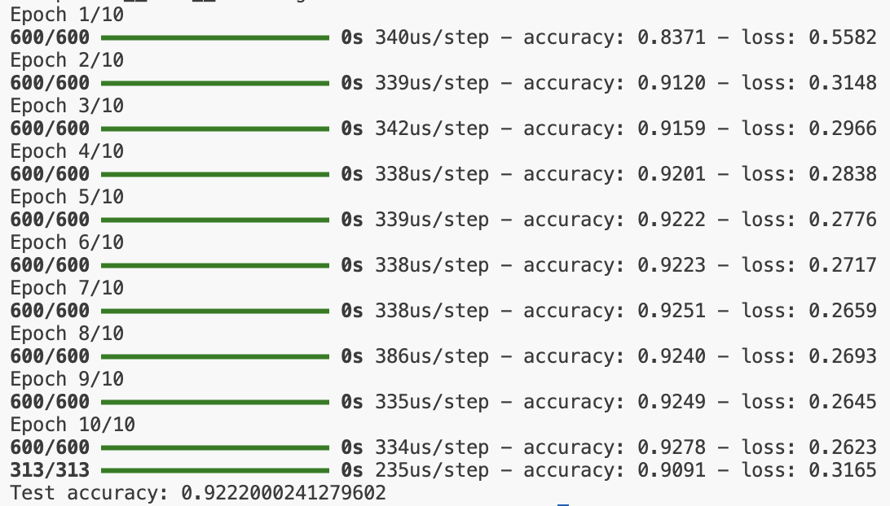
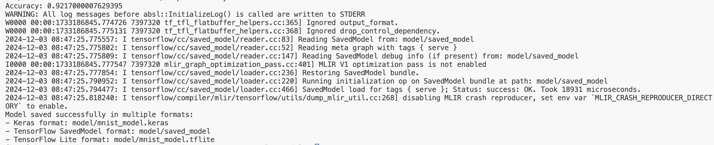
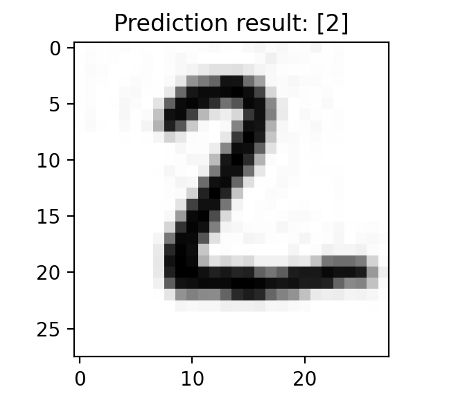
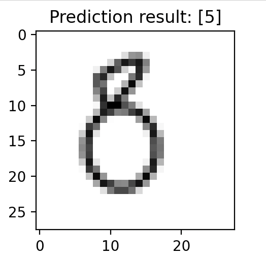

# Android 下使用 Tensorflow 模型实验报告

<center><big><b>PB22050983 胡延伸</b></big></center>

## 实验步骤

### 1. 阅读并运行 Mnist-generate-tensorFlow-model 子目录中的 mnist_test.py。该文件是实现FC 卷积神经网络识别 mnist 手写体的简单例子，参考[1]。记录运行结果中识别的正确率。

由于 Tensorflow 已经更新到 2.x 版本，原先的很多方法失效，故重新撰写代码.

**数据集的加载**

```
# Load MNIST dataset
(x_train, y_train), (x_test, y_test) = mnist.load_data()
```

**模型的定义**

```
model = Sequential([
    Flatten(input_shape=(28, 28)),  # Flatten 28x28 images to 1D vectors
    Dense(10, activation='softmax')  # Output layer with 10 classes
])
```

得到运行结果如下图。



### 2. 阅读并运行 Mnist-generate-tensorFlow-model 子目录中的另外两个 Python 文件。其中 mnist-train.py 利用 .py 利用 TensorFlow 生成 MNIST 手写数字识别的模型文件（缺省存放为 model\mnist.pb）；mnist-prediction.py 利用已经生成的模型文件对测试图片进行数字识别。

Tensorflow 2.x 已经不再对 placeholders, sessions, graph_util, Session 和 Graph 模块支持，故将代码进行修改。

对于 `mnist-train.py`:

**数据集的加载**

```
# 加载 MNIST 数据集
# 下载 http://yann.lecun.com/exdb/mnist/ 的库，把压缩包解压后放在子目录Mnist_data中
(x_train, y_train), (x_test, y_test) = mnist.load_data()
x_train = x_train / 255.0  # 归一化到 [0, 1]
x_test = x_test / 255.0

# 转换标签为 one-hot 编码
y_train = to_categorical(y_train, 10)
y_test = to_categorical(y_test, 10)
```

**创建模型与训练**

```
# 创建模型
model = Sequential([
    Flatten(input_shape=(28, 28), name='input'),  # 输入层
    Dense(10, activation='softmax', name='output')  # 输出层
])

# 编译模型
model.compile(optimizer=SGD(learning_rate=0.01),
              loss='categorical_crossentropy',
              metrics=['accuracy'])

# 训练模型
model.fit(x_train, y_train, batch_size=100, epochs=10)
```

**保存模型**

```
# Save the model in Keras format (recommended for most use cases)
model.save('model/mnist_model.keras')

# Alternatively, if you want to save in HDF5 format
# model.save('model/mnist_model.h5')

# To save in the TensorFlow SavedModel format (for TFLite conversion, TensorFlow Serving, etc.)
tf.saved_model.save(model, 'model/saved_model')

# Convert to TensorFlow Lite format
converter = tf.lite.TFLiteConverter.from_saved_model('model/saved_model')
tflite_model = converter.convert()

# Save the TFLite model
tflite_model_file = 'model/mnist_model.tflite'
with open(tflite_model_file, 'wb') as f:
    f.write(tflite_model)
```

得到训练结果如下图:



对于 `mnist-prediciton.py`:

**加载模型**

```
# 加载保存的模型
print("Loading the model...")
loaded_model = tf.keras.models.load_model(model_path)
```

在 test_image2 得到的预测结果准确，



在 test_image7 和 test_image8 上的得到的预测结果不准.




### 3. 将上一步骤中生成的模型文件拷贝到 Android 项目 Mnist-tensorFlow-AndroidDemo-master 对应的子目录中（Mnist-tensorFlow-AndroidDemo-master\app\src\main\assets\mnist.pb）；编译 Mnist-tensorFlow-AndroidDemo-master 项目。