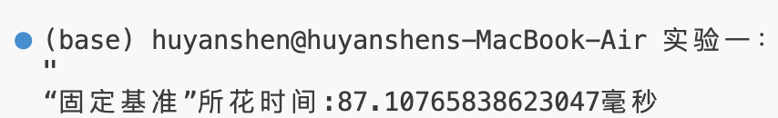
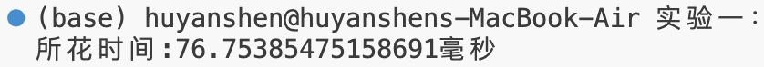
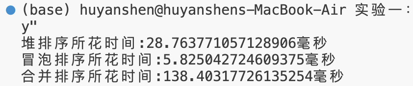

# 第一次实验报告

<center> <big><b>胡延伸 PB22050983</b></big> </center>

---

## 快速排序

### 算法思想

使用分治法，首先将数组 `A[p..r]` 被划分为两个(可能为空)子数组 `A[p..q-1]` 和 `A[q+1..r]`，使得 `A[p..q-1]` 中的每一个元素都小于等于 `A[q]`，而 `A[q]`也小于等于 `A[q+1..r]` 中的每个元素.其中，计算下标 `q` 也是划分过程的一部分。其次，通过递归调用快速排序，对子数组 `A[p..q-1]` 和 `A[q+1..r]` 进行排序，直到最后递归结束。由于子数组都是原址排序，所以不需要合并操作。

### 核心代码

```Python
def PARTITION(A, p ,r): # 数组的划分
    x = A[r]
    i = p - 1
    for j in range(p, r):
        # 将小于主元的元素往前移
        if A[j] <= x:
            i =  i + 1
            A[i], A[j] = A[j], A[i]
    A[i + 1], A[r] = A[r], A[i + 1] # 最后把主元往前移
    return i + 1

def QUICKSORT(A, p, r):
    if p < r:
        q = PARTITION(A, p, r)
        # 对两个子数组递归调用
        QUICKSORT(A, p, q-1)
        QUICKSORT(A, q+1, r)
```

### 运行结果

排序结果见附件 `sorted.txt`, 其中运行时间如下:

{width=60%}

## 快速排序的优化

### 基准的选择

#### 固定基准

即上面的标准的快速排序，此处不再重复。

#### 随机基准

##### 算法思想

将 `A[r]` 与从 `A[p..r]` 中随机选出的一个元素交换。其余的步骤和固定基准相同。

##### 核心代码

```Python
def RANDOMIZED_PARTITION(A, p ,r):
    i = random.choice(range(p, r+1)) # 从 A[p..r] 中随机抽取一个元素
    A[i], A[r] = A[r], A[i]
    return PARTITION(A, p, r)
```

#### 三数取中

##### 算法思想

取左端、中间、右端三个数，然后进行排序，将中间数作为主元, 放在数组的倒数第二个位置。其余的操作和上面两种方法相同。

##### 核心代码

```Python
def MEDIAN_PARTITION(A, p, r):
    mid = (p + r) // 2
    # 对这三个数进行排序
    if A[p] > A[mid]:
        A[p], A[mid] = A[mid], A[p]
    if A[mid] > A[r]:
        A[mid], A[r] = A[r], A[mid]
    if A[p] > A[mid]:
        A[p], A[mid] = A[mid], A[p]
    A[mid], A[r - 1] = A[r - 1], A[mid]
    return PARTITION(A, p, r - 1)
```

#### 运行结果

“随机基准”法和“三数取中”法的运行时间如下图:

{width=60%}

### (习题7.4-5)

#### 算法思想

当输入数据已经“几乎有序”时，使用插入排序速度很快。我们可以利用这一特点来提高快速排序的速度。当对一个长度小于k的子数组调用快速排序时，让它不做任何排序就返回。上层的快速排序调用返回后，对整个数组运行插入排序来完成排序过程。

#### 核心代码

```Python
# 插入排序
def INSERTIONSORT(A, p, r): 
    for i in range(p + 1, r + 1):
        key = A[i]
        j = i - 1
        while j >= p and A[j] > key:
            A[j + 1] = A[j]
            j = j - 1
        A[j + 1] = key

# 划分数组，与上面几种方法相同
def PARTITION(A, p ,r):
    x = A[r]
    i = p - 1
    for j in range(p, r):
        if A[j] <= x:
            i =  i + 1
            A[i], A[j] = A[j], A[i]
    A[i + 1], A[r] = A[r], A[i + 1]
    return i + 1

# 改编版快速排序
def k_QUICKSORT(A, k, p, r):
    # 当子数组的长度小于 k 时，直接调用插入排序
    if abs(p - r) <= k:
        return INSERTIONSORT(A, p, r)
    if p < r:
        q = PARTITION(A, p, r)
        k_QUICKSORT(A, k, p, q-1)
        k_QUICKSORT(A, k, q+1, r)
```

#### 运行结果

运行时间如下图所示:

{width=60%}

### 聚集元素

#### 算法思想

在一次分割结束后，将与本次基准相等的元素聚集在一起，再分割时，不再对聚集过的元素进行分割。执行如下:

- 在划分过程中将与基准值相等的元素放入数组左端，
- 划分结束后，再将左端的元素移到基准值左边。

#### 核心代码

```Python
def AGGREGATE_PARTITION(A, p, r):
    x = A[r]
    i = p - 1
    sup = p - 1
    for j in range(p, r):
        if A[j] <= x:
            i =  i + 1
            A[i], A[j] = A[j], A[i]
            if A[i] == x:
                sup = sup + 1
                A[sup], A[i] = A[i], A[sup]
    A[i + 1], A[r] = A[r], A[i + 1]
    # 将与基准相等的元素聚集在一起
    if sup >= p:
        for k in range(p, sup + 1):
            A[k], A[i + k - sup] = A[i + k - sup], A[k]
    # 返回聚集元素堆的左右端点
    return i + p - sup, i + 1

def AGGREGATE_QUICKSORT(A, p, r):
    if p < r:
        l, q = AGGREGATE_PARTITION(A, p, r)
        AGGREGATE_QUICKSORT(A, p, l-1)
        AGGREGATE_QUICKSORT(A, q+1, r)
```

#### 运行结果

运行时间如下:

{width=60%}

## 运行结果分析

综合以上优化，结合插入排序改造后的快速排序算法的时间可以缩短达到 70ms 左右.

以下分别是堆排序、冒泡排序、合并排序运行时间：

{width=60%}

由此可见，冒泡排序及堆排序均远远快于快速排序，快速排序较合并排序有明显地加快。
