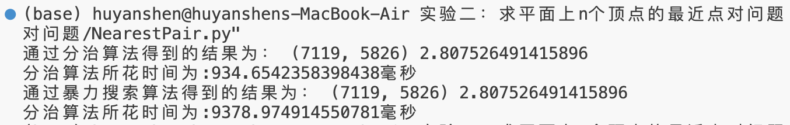

# 实验二实验报告

<center><big><b>胡延伸 PB22050983</b></big></center>

## 实验内容

对文件 `data.txt` 的所有点，求距离最近的一对及其距离。

## 算法设计思路

本实验采用分治算法:

首先初始化三个点集 P, X, Y 均包含 `data.txt` 中所有的点。 其中点集 P, X 中的点均按照 x 坐标单调递增的次序排列；Y 中点按照 y 坐标单调递增的次序排列。

递归前，首先检查是否有 |P| $\le$ 3, 如果成立，则采用暴力搜索的方式，得到最小的点对及其相应的距离。反之，进行如下的递归操作：

**分解**: 将点集 P 以中间一个为界限分为 $P_L$ 和 $P_R$左右两个部分，大小分别为 $\lceil P \rceil$,$\lfloor P \rfloor$, X 也进行相同操作。由于 X, P 预先排列过，故X, P 产生两个子集均按 x 坐标递增排列。但 Y 略有不同，我们的目标是将 Y 也分成 $Y_L$, $Y_R$, 并且它们均按照 y 坐标递增排序，但是 $Y_L$, $Y_R$ 中的点需要分别与 $P_L$ 和 $P_R$ 中的点完全相同。故采用如下算法产生 $Y_L$, $Y_R$:

```
let YL[l.. Y.length ]and YR[1.. Y.length] be new arrays
YL.length = YR.length=0
for i = 1 to Y.length:
    if Y[i] in PL:
        YL.length = YL.length + 1
        YL[YL.length] = Y[i]
    else:
        YR.length = YR. length + 1
        YR[YR.length] = Y[i]
```

**解决**: 把 P 划分为 $P_L$ 和 $P_R$ 后，再进行两次递归调用，一次找出 $P_L$.中的最近点对，另一次找出 $P_R$ 中的最近点对。第一次调用的输人为子集 $P_L$、数组 $X_L$ 和 $Y_L$;第二次调用的输人为子集 $P_R$、$X_R$ 和 $Y_R$ 。令 $P_L$ 和 $P_R$ 返回的最近点对的距离分别为 $\delta_1$ 和 $\delta_2$，并且置 $\delta=min(\delta_1，\delta_2)$。

**合并**:最近点对有两种情况, (1) 某次递归调用找出的距离为 $\delta$ 的点对，(2) $P_L$中的一个点与 $P_R$ 中的一个点组成的点对。因此每次递归调用两次后，需要检查第二种情况。

如果最近点对分别在 $P_L$ 和 $P_R$ 中，则点对中的两个点与中线（中线将 P 一分为二）的距离必定都在 $\delta$ 单位之内。因此它们必定都处于以中线为中心、宽度为 $2\delta$ 的垂直带形区域内。为了找出这样的点对(如果存在)，算法要做如下工作:

1. 建立一个数组Y'，它是把数组Y中所有不在宽度为 $2\delta$ 的垂直带形区域内的点去掉后所得的数组。数组 Y'与Y一样，是按 y 坐标递增排序的。

2. 对数组 Y' 中的每个点 p，算法试图找出 Y' 中距离 p 在 $\delta$ 单位以内的点。在 Y' 中仅需考虑紧随力后的7个点。算法计算出从 p 到这 7 个点的距离，并记录下 Y' 的所有点对中最近点对的距离 $\delta'$。

3. 如果 $\delta'$ < $\delta$，则垂直带形区域内的确包含比根据递归调用所找出的最近距离更近的点对, 则返回该点对及其距离 $\delta'$ 。否则，返回函数的递归调用中发现的最近点对及其距离 $\delta$。

## 源码

```Python
def NEARESTPAIR(P, X, Y):
    # 递归终止条件
    if len(P) <= 3:
        delta = distance(P[0], P[1])
        pair = (P[0][2], P[1][2])
        # 暴力搜索最近点对
        for i in range(len(P)):
            for j in range(i+1, len(P)):
                if delta > distance(P[i], P[j]):
                    pair = (P[i][2], P[j][2])
                    delta = distance(P[i], P[j])
        return pair, delta

    
    # 产生 P, X 的子集
    PL, PR = P[:(len(P)-1)//2+1], P[(len(P)-1)//2+1:]
    XL, XR = X[:(len(X)-1)//2+1], X[(len(P)-1)//2+1:]

    # 产生 Y 的子集
    YL, YR = [], []
    for y in Y:
        if y in PL:
            YL.append(y)
        else:
            YR.append(y)
    
    # 两次递归调用
    pairL, deltaL = NEARESTPAIR(PL, XL, YL)
    pairR, deltaR = NEARESTPAIR(PR, XR, YR)
    pair, delta = (pairL, deltaL) if deltaL < deltaR else (pairR, deltaR)

    # 计算两点分别在两边的情况
    Y0 = [] # 产生 Y'
    for y in Y:
        if abs(y[0] - P[(len(P)-1)//2][0]) < delta:
            Y0.append(y)

    for i in range(len(Y0)):
        for j in range(7):
            if i + j + 1 < len(Y0):
                delta0 = distance(Y0[i], Y0[i + j + 1])
                # 比较𝛿'和𝛿的大小
                if delta0 < delta:
                    delta = delta0
                    pair = (Y0[i][2], Y0[i + j + 1][2])

    return pair, delta
```

## 测试结果与分析

引入暴力搜索算法，如下描述:

```python
def BRUTEFORCE(P):
    # 初始化点对及其距离
    delta = distance(P[0], P[1])
    pair = (P[0][2], P[1][2])

    for i in range(len(P)):
        for j in range(i + 1, len(P)):
            delta0 = distance(P[i], P[j])
            if delta0 < delta:
                delta = delta0
                pair = (P[i][2], P[j][2])
    
    return pair, delta
```
最终在 `data.txt` 中所包含的点的测试结果如下:

{width=80%}

由此可见搜索时间大大减少。