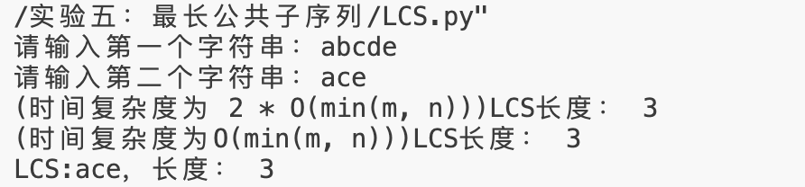
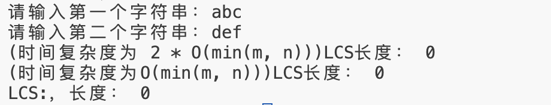

# 实验五实验报告
<center><big><b>胡延伸 PB22050983</b></big></center>

## 1. 实验内容

本实验旨在实现 **最长公共子序列（LCS）算法**，并通过多种优化方式计算 LCS 的长度及其序列，具体包括：

1. 编程实现基础的 LCS 算法，时间复杂度为 **O(m\*n)**，空间复杂度为 **O(m\*n)**，输出 LCS 及其长度。
2. 优化 LCS 算法，降低空间复杂度为 **O(2\*min(m, n))**，输出 LCS 的长度。
3. 进一步优化 LCS 算法，降低空间复杂度为 **O(min(m, n))**，输出 LCS 的长度。

### 输入与输出要求

- **输入**：两个字符串 `text1` 和 `text2`，长度范围为 1 ≤ `text1.length`, `text2.length` ≤ 1000，字符串仅由小写字母组成。
- **输出**：LCS 的长度及其序列（若存在），若无公共子序列则返回长度为 0。

---

## 2. 算法设计思路

### 2.1 基础算法设计（O(m\*n) 时间复杂度，O(m\*n) 空间复杂度）

1. 利用动态规划思想，构造二维数组 `c`，其中 `c[i][j]` 表示字符串 `text1` 前 `i` 个字符与字符串 `text2` 前 `j` 个字符的最长公共子序列的长度。
2. 状态转移方程：
   - 若 `text1[i-1] == text2[j-1]`，则 `c[i][j] = c[i-1][j-1] + 1`
   - 否则，`c[i][j] = max(c[i-1][j], c[i][j-1])`
3. 使用辅助数组 `b` 保存方向，用于回溯构造具体的 LCS。
4. 最终结果：`c[m][n]` 是 LCS 的长度，通过回溯辅助数组 `b` 获取 LCS。

### 2.2 空间优化算法 1（O(m\*n) 时间复杂度，O(2\*min(m, n)) 空间复杂度）

1. 观察状态转移方程，`c[i][j]` 只依赖于 `c[i-1][j-1]`、`c[i-1][j]` 和 `c[i][j-1]`。
2. 可以优化为仅存储两行数据：`c[0][:]` 和 `c[1][:]`，交替更新以节省空间。

### 2.3 空间优化算法 2（O(m\*n) 时间复杂度，O(min(m, n)) 空间复杂度）

1. 在优化算法 1 的基础上，进一步观察 `c[i][j]` 的依赖关系。
2. 仅用一个一维数组 `c[:]` 存储当前行的结果，动态更新即可。

---

## 3. 源码与注释

以下是实现代码：

```python
# 基础LCS算法（O(m*n) 时间复杂度，O(m*n) 空间复杂度）
def LCS_LENGTH(X, Y):
    m = len(X)
    n = len(Y)
    # 初始化二维数组c和b
    b = [[0 for _ in range(n+1)] for _ in range(m+1)]
    c = [[0 for _ in range(n+1)] for _ in range(m+1)]
    
    # 填充二维数组
    for i in range(1, m+1):
        for j in range(1, n+1):
            if X[i-1] == Y[j-1]:  # 字符匹配
                c[i][j] = c[i-1][j-1] + 1
                b[i][j] = '↖'  # 记录回溯方向
            elif c[i-1][j] >= c[i][j-1]:  # 向上取最大值
                c[i][j] = c[i-1][j]
                b[i][j] = '↑'
            else:  # 向左取最大值
                c[i][j] = c[i][j-1]
                b[i][j] = '←'
    return c, b

# 空间优化算法 1（O(m*n) 时间复杂度，O(2*min(m, n)) 空间复杂度）
def LCS_LENGTH_UPDATE_1(X, Y):
    if len(X) < len(Y):
        X, Y = Y, X
    m, n = len(X), len(Y)
    c = [[0 for _ in range(n+1)] for _ in range(2)]  # 两行数据交替更新
    
    for i in range(1, m+1):
        for j in range(1, n+1):
            if X[i-1] == Y[j-1]:
                c[1][j] = c[0][j-1] + 1
            else:
                c[1][j] = max(c[0][j], c[1][j-1])
        c[0] = c[1][:]  # 当前行变为上一行
    print(f"(空间复杂度O(2*min(m, n))) LCS长度：{c[1][n]}")

# 空间优化算法 2（O(m*n) 时间复杂度，O(min(m, n)) 空间复杂度）
def LCS_LENGTH_UPDATE_2(X, Y):
    if len(X) < len(Y):
        X, Y = Y, X
    m, n = len(X), len(Y)
    c = [0 for _ in range(n+1)]  # 一维数组存储结果
    
    for i in range(1, m+1):
        prev = 0  # 保存上一行的左上角值
        for j in range(1, n+1):
            temp = c[j]  # 暂存当前值
            if X[i-1] == Y[j-1]:
                c[j] = prev + 1
            else:
                c[j] = max(c[j], c[j-1])
            prev = temp  # 更新左上角值
    print(f"(空间复杂度O(min(m, n))) LCS长度：{c[n]}")

# 回溯LCS
def PRINT_LCS(b, X, i, j):
    if i == 0 or j == 0:
        return
    if b[i][j] == '↖':
        PRINT_LCS(b, X, i-1, j-1)
        print(X[i-1], end='')
    elif b[i][j] == '↑':
        PRINT_LCS(b, X, i-1, j)
    else:
        PRINT_LCS(b, X, i, j-1)

# 主程序
while True:
    X = input("请输入第一个字符串：")
    Y = input("请输入第二个字符串：")
    
    # 空间优化算法 1 输出长度
    LCS_LENGTH_UPDATE_1(X, Y)
    # 空间优化算法 2 输出长度
    LCS_LENGTH_UPDATE_2(X, Y)
    # 基础算法输出LCS及其长度
    c, b = LCS_LENGTH(X, Y)
    print("LCS: ", end='')
    PRINT_LCS(b, X, len(X), len(Y))
    print(f"，长度：{c[len(X)][len(Y)]}")
    
    if input("输入0退出，输入其他继续：") == '0':
        break
```

---

## 4. 算法测试结果

### 测试 1

输入：  
`text1 = "abcde"`  
`text2 = "ace"`  

输出：  
- 空间复杂度 O(2\*min(m, n))：LCS 长度为 3  
- 空间复杂度 O(min(m, n))：LCS 长度为 3  
- LCS: `"ace"`，长度：3



### 测试 2

输入：  
`text1 = "abc"`  
`text2 = "def"`  

输出：  
- 空间复杂度 O(2\*min(m, n))：LCS 长度为 0  
- 空间复杂度 O(min(m, n))：LCS 长度为 0  
- LCS: `0`



---

## 5. 总结

1. 实现了三种不同空间复杂度的 LCS 算法，时间复杂度均为 O(m\*n)，但空间复杂度逐步优化，分别为 O(m\*n)、O(2\*min(m, n)) 和 O(min(m, n))。
2. 测试结果表明，优化后的算法在空间效率上显著提升，适合处理较长的字符串。
3. 基础算法能完整输出 LCS 序列，而优化算法仅能输出 LCS 的长度。