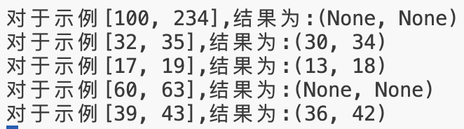

# 第四次实验报告

<center><big><b>胡延伸 PB22050983</b></big></center>

## 实验内容

对红黑树进行修改，使其成为一颗区间数，并实现区间树上的重叠区间查找算法。

## 实验目的

1. 程序输入为一个 insert.txt，生成一个红黑树
2. 待查询区间应由控制台输入，程序输出为查找结果

## 区间树的数据结构

1. 红黑树结点结构: 一共有 8 个属性
   - low： 区间左端点
   - high：区间右端点
   - key：设置为 low
   - parent，left，right：结点的父结点、左右孩子
   - color：结点颜色（红/黑）
   - max：本结点右端点，左右孩子的max，这三个值的最大值，初始化为本结点的右端点
2. 红黑树操作：
    - 插入结点 RB_INSERT
    - 左旋右旋操作 LEFT_ROTATE, RIGHT_ROTATE
    - 插入维护操作 RB_INSERT_FIX_UP
    - 修正 MAX 操作 UPDATE_MAX: 用于左旋右旋/插入维护后修正 MAX 属性
    - 区间查找 INTERVAL_SEARCH

## 源码

### 红黑树插入:

```Python

def RB_INSERT(self, z):
        y = self.nil
        x = self.root
        while x != self.nil: # 往下寻找插入位置
            y = x
            if z.key < x.key:
                x = x.left
            else:
                x = x.right
        z.parent = y
        if y == self.nil:
            self.root = z
        elif z.key < y.key:
            y.left = z
        else:
            y.right = z
        z.left = self.nil
        z.right = self.nil
        z.color = 'RED'
        self.RB_INSERT_FIXUP(z) # 维护红黑树性质
        self.UPDATE_MAX(z)  # 更新 max 属性

```

### 插入维护

```Python
def RB_INSERT_FIXUP(self, z):
        while z.parent.color == 'RED':
            if z.parent == z.parent.parent.left:
                y = z.parent.parent.right
                if y.color == 'RED':                    # case 1
                    # print('Case 1')
                    z.parent.color = 'BLACK'
                    y.color = 'BLACK'
                    z.parent.parent.color = 'RED'
                    z = z.parent.parent
                else:
                    if z == z.parent.right:             # case 2，将其转换为 case 3
                        # print('Case 2')
                        z = z.parent
                        self.LEFT_ROTATE(z)
                    # print('Case 3')
                    z.parent.color = 'BLACK'            # case 3
                    z.parent.parent.color = 'RED'
                    self.RIGHT_ROTATE(z.parent.parent)
            else:
                y = z.parent.parent.left                # 与上述情况完全对称
                if y.color == 'RED':                    # case 4
                    #print('Case 4')
                    z.parent.color = 'BLACK'
                    y.color = 'BLACK'
                    z.parent.parent.color = 'RED'
                    z = z.parent.parent
                else:
                    if z == z.parent.left:              # case 5，将其转换为 case 6
                        #print('Case 5')
                        z = z.parent
                        self.RIGHT_ROTATE(z)
                    #print('Case 6')
                    z.parent.color = 'BLACK'            # case 6
                    z.parent.parent.color = 'RED'
                    self.LEFT_ROTATE(z.parent.parent)
        self.root.color = 'BLACK'

```

### 更新 max

```Python
def UPDATE_MAX(self, node):
        while node != self.nil: # 一直向上修正
            node.max = max(
                node.high,
                node.left.max if node.left != self.nil else float('-inf'),
                node.right.max if node.right != self.nil else float('-inf')
            ) # 取这三个值最大值
            node = node.parent
```

### 左旋右旋

```Python
def LEFT_ROTATE(self, x):
        y = x.right
        x.right = y.left
        if y.left != self.nil:
            y.left.parent = x
        y.parent = x.parent
        if x.parent == self.nil:
            self.root = y
        elif x == x.parent.left:
            x.parent.left = y
        else:
            x.parent.right = y
        y.left = x
        x.parent = y
        # Update max attributes
        self.UPDATE_MAX(x)
        self.UPDATE_MAX(y)

    def RIGHT_ROTATE(self, y):
        x = y.left
        y.left = x.right
        if x.right != self.nil:
            x.right.parent = y
        x.parent = y.parent
        if y.parent == self.nil:
            self.root = x
        elif y == y.parent.right:
            y.parent.right = x
        else:
            y.parent.left = x
        x.right = y
        y.parent = x
        # Update max attributes
        self.UPDATE_MAX(y)
        self.UPDATE_MAX(x)
        
```

## 测试结果

实验准备了几个示例：[100, 234], [32, 35], [17, 19], [60, 63], [39, 43]。

测试结果如下：



## 困难及收获

1. 主要困难是实现 UPDATE_MAX, 解决方法是理解红黑树的操作逻辑：自顶向下或自底向上
2. 收获：对红黑树的结构、结构及其应用有了进一步的了解